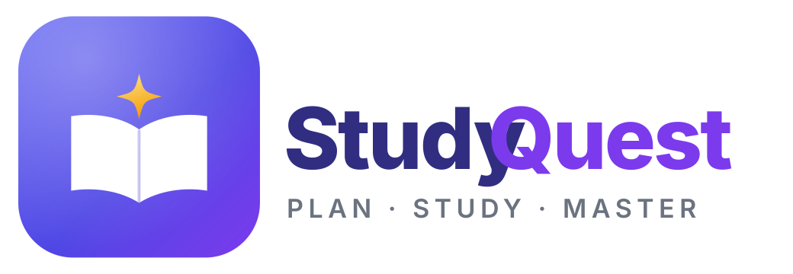

<p align="center">
  
</p>

# Study Quest

> Don't just tell students what they need to study. Help them actually learn it.

Study Quest is a study and task-management app for secondary school and university students
(also useful for independent learners). Instead of being "another place to write notes or
tick off tasks", it guides you through the whole learning journey:

**Plan → Study → Understand → Practice → Quiz → Review → Improve**

The full specification lives in [`docs/PRD.md`](docs/PRD.md) (source document:
[`Study Quest PRD.docx`](Study%20Quest%20PRD.docx)).

---

## Product Vision

Study Quest should make studying feel organized, interactive and rewarding. Opening the app
should immediately answer:

- What do I need to do?
- What should I study?
- What do I need to improve?
- How am I progressing?
- What should I do next?

It should feel like a personal study companion and quest guide, not a normal task manager.

## Target Users

| Primary | Secondary |
| --- | --- |
| Secondary school students | Independent learners |
| University students | Exam candidates, self-taught learners |

## Core Experience

A "Chemistry Exam Quest" walks a student through:

1. Add or write Chemistry notes
2. Read the notes
3. Generate a summary
4. Ask for an explanation of a difficult concept
5. Create flashcards
6. Take a quiz
7. Review incorrect answers
8. Take a short retry quiz
9. Mark the topic complete
10. Earn XP and progress toward the goal

Students choose how much guidance they want: just complete a task, run a focus session, or
follow the full guided journey.

## Main Sections

1. **Home** — progress, today's quest, current goals, recommendations, quick actions
2. **Tasks** — assignments, deadlines, recurring tasks, study tasks
3. **Study** — subjects, topics, notes, summaries, flashcards, explanations, quizzes
4. **Quests** — current, completed and special quests, plus quest progress
5. **Progress** — XP, levels, streaks, achievements, statistics, subject progress

## Feature Highlights

- **Subjects & topics** — `Subject → Topic → Notes / Quizzes / Flashcards / Tasks`
- **Notes** — type or paste, then summarize, explain, quiz, flashcard, read aloud, study
- **AI summaries** — length (quick / standard / detailed) and format (paragraph, bullets,
  key points, exam-style), always grounded in the student's own notes
- **Explain** — simple, step-by-step, example, real-life or "explain like I'm a beginner"
- **Read My Notes** — listen, follow along with highlighting, and pause to ask "Explain this"
- **Quiz generator** — 5/10/15/20 questions, multiple choice / true-false / short answer,
  easy → hard difficulty
- **Quiz results** — score, correct/incorrect, explanations, weak topics
- **Smart retry quizzes** — a smaller quiz built from the questions you got wrong
- **Flashcards** — flip, mark known / needs review, tied to a topic
- **Task manager** — title, subject, topic, deadline, priority, notes, related activity
- **Recurring tasks** — e.g. "Study Mathematics every Monday, Wednesday and Friday"
- **Connected tasks** — suggests a 20-minute review and a short quiz before a task is done
- **Study planning** — manual, suggested or fully automatic schedules
- **Daily Study Quest** — a personalized daily activity list with progress
- **Quest system** — quests as real study goals with steps, plus exam / weekly / subject /
  personal quests
- **Gamification** — XP, levels, streaks, badges, achievements, milestones, quest rewards
- **Progress tracking** — study time, tasks, quests, quiz scores and improvement over time
- **Study sessions** — quick focus, timed focus, or guided (Read → Understand → Practice →
  Quiz → Review)
- **Recommendations** — helpful next steps, never overwhelming
- **Notifications** — deadlines, sessions, quests, revision, streaks, unfinished tasks
- **Search** — across subjects, topics, notes, tasks, quizzes, flashcards and quests

## MVP Scope

**Essential:** home dashboard · subjects and topics · task manager · notes · AI summaries ·
AI explanations · quiz generation with multiple question types and difficulty · quiz results ·
retry quizzes · flashcards · Read My Notes · study sessions · daily quests · XP · levels ·
streaks · basic achievements · progress tracking · study planning.

**Later:** photo notes · PDF/document uploads · advanced achievements · more special quest
types · social features · leaderboards · shared study groups · advanced personalization.

## Product Principles

1. **Learning comes first** — gamification encourages learning, it never distracts from it.
2. **Simple but powerful** — many useful features, never confusing.
3. **Everything connects** — tasks, notes, quizzes, subjects, quests and progress work together.
4. **Students stay in control** — the app recommends, the student decides.
5. **Always answer "What's next?"** — after finishing something, help the student choose what
   to do next.

## ## Running the app

The app and the database both run locally. The database is the only container.

```bash
pnpm setup     # checks Node/pnpm/Docker, creates .env, starts Postgres, installs deps
pnpm dev       # database + API on :4321 + web on :5173
```

Prerequisites: Node 22 LTS, pnpm, Docker Desktop. Optionally a Cloudflare account for R2 file
storage and an AI provider — the app runs without either.

See the [Repository Contents](#repository-contents) below for what lives where, and
[docs/PRD.md](docs/PRD.md#appendix-a--technical-approach-and-decisions) Appendix A for the
technology decisions and their rationale.

## Repository Contents

```
Study quest/
├── README.md                  # this file
├── Study Quest PRD.docx       # original requirements document (v1.0, by Praise)
├── docker-compose.yml         # local PostgreSQL 17 (the only container)
├── .env.example               # DATABASE_URL, R2 and AI settings
├── brand/                     # logo and brand assets
│   ├── logo-mark.svg          # app icon
│   ├── logo-lockup.svg        # logo + wordmark
│   ├── logo-mono.svg          # single-colour mark
│   └── favicon.svg            # simplified small-size mark
├── db/
│   └── init.sql               # extensions on first container start
├── docs/
│   ├── PRD.md                 # requirements + Appendix A (tech decisions and why)
│   └── IMPLEMENTATION_PLAN.md # design system + architecture + all 23 phases
└── (created during P0) apps/, packages/, scripts/, data/
```

## Documentation

| Document | What it covers |
| --- | --- |
| [docs/PRD.md](docs/PRD.md) | The product requirements, plus Appendix A recording the technology decisions and their rationale |
| [docs/IMPLEMENTATION_PLAN.md](docs/IMPLEMENTATION_PLAN.md) | Everything needed to build the product, in one document |

The implementation plan has three parts:

| Part | Sections | What it covers |
| --- | --- | --- |
| **I — Design system** | §1–§13 | Brand and logo usage, colour, typography, spacing, motion, layout, component inventory, theming, voice, accessibility |
| **II — Architecture** | §14–§22 | Stack, system shape, repository layout, 26 architecture decisions, data model, API surface, AI layer, non-functional targets, technical risks |
| **III — Delivery plan** | §23–§30 | 23 phases in 6 milestones, with checklists, exit criteria, effort, traceability, risks and backlog |

## Technical direction

The app and the database run locally, at no cost:

| Concern | Choice | Runs |
| --- | --- | --- |
| App framework | React 19 + TypeScript + Vite, installable as a PWA | Local |
| Database | PostgreSQL 17 + Drizzle ORM, in Docker | Local container |
| Authentication | Better Auth (email + password, local sessions) | Local |
| File storage | Cloudflare R2 (10 GB free, no egress fees) | Cloud — the only exception |
| Server | Hono on Node.js 22, serving the app and API from one process | Local |
| AI | Provider-agnostic: Ollama locally (free, offline) or any cloud key | Local or cloud |
| Search | PostgreSQL full-text + `pg_trgm` | Local container |
| Also | Tailwind CSS v4, Zod, TanStack Query, Storybook, Vitest, Playwright | Local |

The reasoning behind each choice, the alternatives considered, and the trade-offs are recorded
in [docs/PRD.md](docs/PRD.md#appendix-a--technical-approach-and-decisions) Appendix A.

See Part II of the [implementation plan](docs/IMPLEMENTATION_PLAN.md#14-context-and-constraints)
for the architecture behind each choice.

## Status

Requirements defined (PRD v1.0), design system and architecture decided, and a 23-phase
implementation plan written. Next step is Phase 0: local toolchain and project skeleton.

## License

To be decided.
