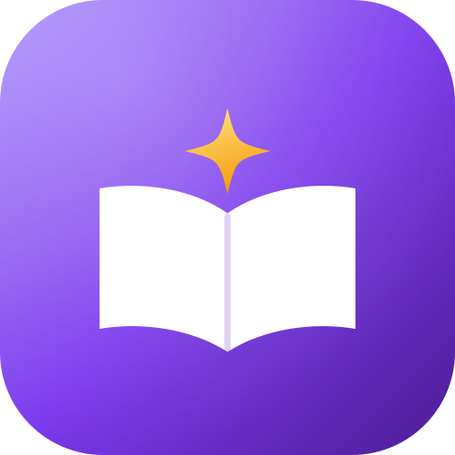

<p align="center">
  
</p>

# Study Quest

> Don't just tell students what they need to study. Help them actually learn it.

Study Quest is a study and task-management app for secondary school and university students
(also useful for independent learners). Instead of being "another place to write notes or
tick off tasks", it guides you through the whole learning journey:

**Plan → Study → Understand → Practice → Quiz → Review → Improve**

The full specification lives in [`docs/PRD.md`](docs/PRD.md) (source document:
[`Study Quest PRD.docx`](Study%20Quest%20PRD.docx)).

---

## Product Vision

Study Quest should make studying feel organized, interactive and rewarding. Opening the app
should immediately answer:

- What do I need to do?
- What should I study?
- What do I need to improve?
- How am I progressing?
- What should I do next?

It should feel like a personal study companion and quest guide, not a normal task manager.

## Target Users

| Primary                   | Secondary                             |
| ------------------------- | ------------------------------------- |
| Secondary school students | Independent learners                  |
| University students       | Exam candidates, self-taught learners |

## Core Experience

A "Chemistry Exam Quest" walks a student through:

1. Add or write Chemistry notes
2. Read the notes
3. Generate a summary
4. Ask for an explanation of a difficult concept
5. Create flashcards
6. Take a quiz
7. Review incorrect answers
8. Take a short retry quiz
9. Mark the topic complete
10. Earn XP and progress toward the goal

Students choose how much guidance they want: just complete a task, run a focus session, or
follow the full guided journey.

## Main Sections

1. **Home** — progress, today's quest, current goals, recommendations, quick actions
2. **Tasks** — assignments, deadlines, recurring tasks, study tasks
3. **Study** — subjects, topics, notes, summaries, flashcards, explanations, quizzes
4. **Quests** — current, completed and special quests, plus quest progress
5. **Progress** — study time heatmap, quiz scores over time, XP, levels, streaks, achievements, subject and topic progress

## Feature Highlights

- **Subjects & topics** — `Subject → Topic → Notes / Quizzes / Flashcards / Tasks`
- **Notes** — type or paste, then summarize, explain, quiz, flashcard, read aloud, study
- **AI summaries** — length (quick / standard / detailed) and format (paragraph, bullets,
  key points, exam-style), always grounded in the student's own notes
- **Explain** — simple, step-by-step, example, real-life or "explain like I'm a beginner"
- **Read My Notes** — listen, follow along with highlighting, and pause to ask "Explain this"
- **Quiz generator** — 5/10/15/20 questions, multiple choice / true-false / short answer,
  easy → hard difficulty
- **Quiz results** — score, correct/incorrect, explanations, weak topics
- **Smart retry quizzes** — a smaller quiz built from the questions you got wrong
- **Flashcards** — flip, mark known / needs review, tied to a topic
- **Task manager** — title, subject, topic, deadline, priority, notes, related activity
- **Recurring tasks** — e.g. "Study Mathematics every Monday, Wednesday and Friday"
- **Connected tasks** — suggests a 20-minute review and a short quiz before a task is done
- **Study planning** — manual, suggested or fully automatic schedules
- **Daily Study Quest** — a personalized daily activity list with progress
- **Quest system** — quests as real study goals with steps, plus exam / weekly / subject /
  personal quests
- **Gamification** — XP, levels, streaks, badges, achievements, milestones, quest rewards
- **Progress tracking** — study time, tasks, quests, quiz scores and improvement over time
- **Study sessions** — quick focus, timed focus, or guided (Read → Understand → Practice →
  Quiz → Review)
- **Recommendations** — helpful next steps, never overwhelming
- **Notifications** — a bell with deadline, session, quest, revision, streak and digest nudges;
  per-type switches, quiet hours and snooze, all in the student's hands
- **Search** — the ⌘K / Ctrl+K palette or the search page: across subjects, topics, notes,
  tasks, quizzes, flashcards and quests, typo-tolerant ("newtn" finds "Newton"), filterable by
  type and subject, with recent queries and results that jump straight to the highlighted row
- **Installable & offline** — install to a home screen (desktop or phone): the app and every
  page you have opened keep working with no network, edits to existing items queue on the
  device and sync in order when you are back, and new versions wait for your Reload
- **LAN mode** — flip it on in Settings to reach the app (and install it) from a phone on the
  same Wi-Fi: everything asks for a 4-digit PIN first, and `scripts/lan-setup.ps1` + `pnpm lan`
  serve it over HTTPS so the phone accepts the install

## MVP Scope

**Essential:** home dashboard · subjects and topics · task manager · notes · AI summaries ·
AI explanations · quiz generation with multiple question types and difficulty · quiz results ·
retry quizzes · flashcards · Read My Notes · study sessions · daily quests · XP · levels ·
streaks · basic achievements · progress tracking · study planning.

**Later:** photo notes · PDF/document uploads · advanced achievements · more special quest
types · social features · leaderboards · shared study groups · advanced personalization.

## Product Principles

1. **Learning comes first** — gamification encourages learning, it never distracts from it.
2. **Simple but powerful** — many useful features, never confusing.
3. **Everything connects** — tasks, notes, quizzes, subjects, quests and progress work together.
4. **Students stay in control** — the app recommends, the student decides.
5. **Always answer "What's next?"** — after finishing something, help the student choose what
   to do next.

## Running the app

Everything runs on this machine. Node 22 LTS and pnpm are the only prerequisites; the
database is your choice of three (see below).

```powershell
.\scripts\setup.ps1     # checks Node/pnpm/Docker, writes .env, installs, starts the database
pnpm db:seed            # levels and achievements (the server also writes these at boot)
pnpm dev:all            # API on :4321 + web on :5173
```

By hand, the same three steps are `copy .env.example .env`, `pnpm install`, `pnpm db:up` —
or point `DATABASE_URL` at a hosted Postgres instead (a Neon branch, say) and skip `db:up`
along with Docker entirely.

Then open **http://localhost:5173** and create an account. Onboarding ends by offering
starter subjects — one arrives with a worked example, so the app is never an empty shell.

To run it like an app instead of a dev build — one process serving the built app and the
API, and starting at Windows logon:

```powershell
.\scripts\start.ps1                 # builds, then serves http://localhost:4321
.\scripts\install-autostart.ps1      # start it automatically when you sign in
```

Day-to-day questions (which database is in use, why a logon did not start the app, where
backups live) are answered in **[docs/USER_GUIDE.md](docs/USER_GUIDE.md)**.

| Command                  | What it does                                                       |
| ------------------------ | ------------------------------------------------------------------ |
| `pnpm dev:all`           | Database, API and web app together                                 |
| `pnpm verify`            | Typecheck, lint and the unit tests                                 |
| `pnpm test`              | Unit tests over the XP curve, planning, privacy, search and routes |
| `pnpm budget`            | Build, then check the bundle against its size budget               |
| `pnpm storybook`         | Component catalogue on http://localhost:6006                       |
| `pnpm db:seed`           | 50 levels, 10 achievements                                         |
| `pnpm db:up` / `db:down` | Start or stop the PostgreSQL container                             |
| `pnpm build`             | Production build of the web app                                    |

**The database has two drivers.** With `DATABASE_URL` set it uses PostgreSQL 17 — either
the Docker container (`pnpm db:up`) or any hosted Postgres, such as a Neon branch, which
needs no container at all. Without it, the app falls back to **PGlite** — real PostgreSQL
compiled to WebAssembly, running in-process — so it starts before any database is
configured. The same generated SQL applies to all three, and the server writes the level
curve and achievement catalogue itself at boot.

Prerequisites: Node 22 LTS and pnpm. Docker Desktop is needed only for the containerised
database. A Cloudflare account (R2) and an AI provider are both optional — the app runs
without either.

See [Repository Contents](#repository-contents) below for what lives where, and
[docs/PRD.md](docs/PRD.md#appendix-a--notes-technical-approach-and-decisions) Appendix A for the
technology decisions and their rationale.

## Repository Contents

```
Study quest/
├── README.md                  # this file
├── Study Quest PRD.docx       # original requirements document (v1.0, by Praise)
├── docker-compose.yml         # local PostgreSQL 17 (the only container)
├── .env.example               # DATABASE_URL, R2 and AI settings
├── package.json               # pnpm workspace root and scripts
├── tsconfig.base.json         # shared strict TypeScript config
├── eslint.config.js           # includes the "no raw hex" design-system rule
├── vitest.config.ts
├── design.html                # colour, type, buttons and inputs reference
├── design-preview.html        # full preview with screens, light and dark
├── .storybook/                # component catalogue config
├── .github/workflows/ci.yml   # typecheck, lint, test, build, migration check
├── apps/
│   ├── web/                   # React PWA
│   │   └── src/
│   │       ├── app/           # shell, route guards, theme
│   │       ├── features/     # home, tasks, study, quests, progress, auth, onboarding
│   │       └── lib/          # auth client, session, health
│   └── server/                # Hono API, auth, routes, seed, migration check
├── packages/
│   ├── ui/                    # design system: tokens, components, fonts, stories
│   ├── core/                  # XP curve, levels, streaks, progress, starter templates
│   └── db/                    # Drizzle schema, client, generated migrations
├── brand/                     # the logo and its derivatives
├── db/
│   └── init.sql               # extensions on first container start
├── docs/
│   ├── PHASES.md              # phase index — start here
│   ├── USER_GUIDE.md          # run it, use it daily, fix it when it breaks
│   ├── PRD.md                 # requirements + Appendix A (notes: tech decisions)
│   └── IMPLEMENTATION_PLAN.md # design system + architecture + all 23 phases
├── scripts/                   # setup, dev, start, backup and logon autostart helpers
└── data/                      # local database, backups and logs (git-ignored)
```

## Build order

The work is split into **23 sequential phases** across 6 milestones. **P0–P19 is the MVP.**

| Milestone                    | Outcome                                                  | Phases  | Days  |
| ---------------------------- | -------------------------------------------------------- | ------- | ----- |
| **M0 Foundation**            | App runs locally, looks like Study Quest, has an account | P0–P3   | 13 ✅ |
| **M1 Learn**                 | Organise subjects, write notes, AI works                 | P4–P6   | 12    |
| **M2 Understand & Practice** | The full Plan→Review loop works                          | P7–P10  | 18    |
| **M3 Organise**              | Study Quest guides the day                               | P11–P14 | 15    |
| **M4 Motivate**              | Progress visible, "what's next?" always answered         | P15–P19 | 15    |
| **M5 Ship**                  | Installable, accessible, backed up, running daily        | P20–P22 | 11    |

Full checklists and exit criteria: [docs/PHASES.md](docs/PHASES.md). **Milestone 0 is complete** —
see its status table there.

## Brand

| File                                         | Status       | Use                                           |
| -------------------------------------------- | ------------ | --------------------------------------------- |
| [`brand/logo-mark.svg`](brand/logo-mark.svg) | **The logo** | Everywhere in the product                     |
| `brand/favicon.svg`                          | Derivative   | ≤ 32 px — the same mark, spine detail removed |
| `brand/logo-mono.svg`                        | Derivative   | Single colour, for print and watermarks       |

The mark is an open book beneath a gold quest star. The interface uses one accent hue
(`iris`) and warm neutrals (`sand`); gold appears only on rewards. Subjects are identified by
monogram, not colour. See [Part I §2–§3](docs/IMPLEMENTATION_PLAN.md) of the plan for the rules,
and what changed from the first preview in
[PRD Appendix A §A.7](docs/PRD.md#a7-design-changes-made-to-the-first-preview).

**See it rendered:**

| File                                         | Shows                                                           |
| -------------------------------------------- | --------------------------------------------------------------- |
| [`design.html`](design.html)                 | Colour ramps, type scale, buttons, inputs — the reference sheet |
| [`design-preview.html`](design-preview.html) | The above plus Home, an empty state, and a dark theme           |

## Documentation

| Document                                                   | What it covers                                                                                                |
| ---------------------------------------------------------- | ------------------------------------------------------------------------------------------------------------- |
| [docs/PHASES.md](docs/PHASES.md)                           | **Start here** — the 23 phases in order, one line each, with links                                            |
| [docs/USER_GUIDE.md](docs/USER_GUIDE.md)                   | Running it, using it daily, autostart, and the fixes for everything that actually goes wrong                  |
| [docs/PRD.md](docs/PRD.md)                                 | The product requirements, plus Appendix A — notes on the technology decisions, their rationale and trade-offs |
| [docs/IMPLEMENTATION_PLAN.md](docs/IMPLEMENTATION_PLAN.md) | Everything needed to build the product, in one document                                                       |

The implementation plan has three parts:

| Part                    | Sections | What it covers                                                                                                                                |
| ----------------------- | -------- | --------------------------------------------------------------------------------------------------------------------------------------------- |
| **I — Design system**   | §1–§13   | Brand and logo usage, colour, typography, spacing, motion, layout, component inventory, theming, voice, accessibility                         |
| **II — Architecture**   | §14–§22  | Stack, system shape, repository layout, 26 architecture decisions, data model, API surface, AI layer, non-functional targets, technical risks |
| **III — Delivery plan** | §23–§30  | 23 phases in 6 milestones, with checklists, exit criteria, effort, traceability, risks and backlog                                            |

## Technical direction

The app runs locally, at no cost; the database can too:

| Concern        | Choice                                                              | Runs                       |
| -------------- | ------------------------------------------------------------------- | -------------------------- |
| App framework  | React 19 + TypeScript + Vite, installable as a PWA                  | Local                      |
| Database       | PostgreSQL 17 + Drizzle ORM — Docker, hosted (e.g. Neon), or PGlite | Local or hosted            |
| Authentication | Better Auth (email + password, local sessions)                      | Local                      |
| File storage   | Cloudflare R2 (10 GB free, no egress fees)                          | Cloud — the only exception |
| Server         | Hono on Node.js 22, serving the app and API from one process        | Local                      |
| AI             | Provider-agnostic: Ollama locally (free, offline) or any cloud key  | Local or cloud             |
| Search         | PostgreSQL full-text search, with a bounded fuzzy pass for typos    | With the database          |
| Also           | Zod, TanStack Query, Storybook, Vitest                              | Local                      |

The reasoning behind each choice, the alternatives considered, and the trade-offs are recorded
in [docs/PRD.md](docs/PRD.md#appendix-a--notes-technical-approach-and-decisions) Appendix A.

See Part II of the [implementation plan](docs/IMPLEMENTATION_PLAN.md#14-context-and-constraints)
for the architecture behind each choice.

## Status

All 23 phases are built: the MVP (P0–P19), installability, offline use, backups and
accessibility (P20–P21), and the release work of P22 — first-run content, a privacy page
with a real erase, logon autostart and this documentation. Released as **v0.1.0**. What
remains is the two-week daily-use beta, which is a person using it rather than a ticket
to close; the phase-by-phase record is in [docs/PHASES.md](docs/PHASES.md).

## License

To be decided.
