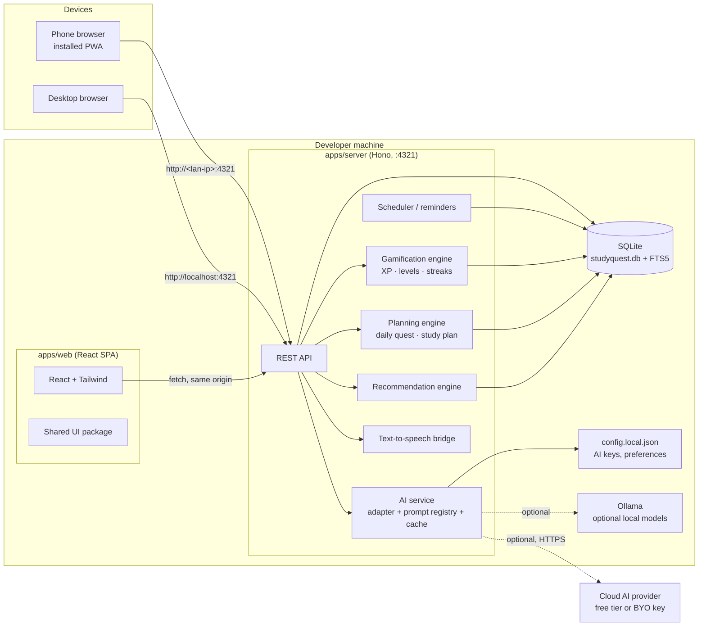
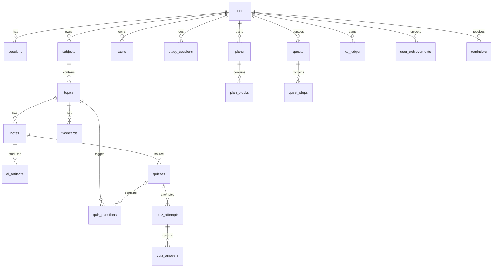

# Study Quest — Architecture

Version 1.0 · Status: proposed, ready for review

---

## 1. Context and constraints

These drove every decision below:

1. **Runs locally on the developer's computer.** One command starts everything. No cloud
   account, no hosting bill, no deploy pipeline required to use the app.
2. **Zero recurring cost.** Every dependency is free, open source, or local.
3. **Single user, single device owner** — but the data model is multi-user from day one so it
   can move to a server later without a rewrite.
4. **Mobile-first PWA.** The primary interface is a phone; the same build runs on desktop.
5. **AI features are the product's differentiator**, and must work with whatever model the user
   has — a local Ollama model at zero cost, or any cloud provider key.
6. **Student data is sensitive.** Notes are the student's own words; nothing leaves the machine
   except an explicit AI request, and there is no telemetry by default.

### 1.1 Chosen stack

| Layer | Choice | Cost |
| --- | --- | --- |
| Runtime | Node.js 22 LTS | Free |
| Package manager | pnpm workspaces | Free |
| Frontend | React 19 + TypeScript + Vite | Free |
| Styling | Tailwind CSS v4 + CSS variable tokens | Free |
| Routing | React Router (SPA) | Free |
| Server | Hono on Node (`@hono/node-server`) | Free |
| Database | SQLite via `better-sqlite3` | Free |
| ORM + migrations | Drizzle ORM | Free |
| Validation | Zod (shared contracts) | Free |
| Server state | TanStack Query | Free |
| UI state | Zustand | Free |
| AI | Provider adapters: Ollama (local) / Gemini / Groq / OpenAI-compatible / mock | Free tiers |
| Speech | Web Speech API (browser) | Free |
| Search | SQLite FTS5 | Built in |
| Components | Storybook | Free |
| Tests | Vitest + React Testing Library + Playwright | Free |
| PWA | vite-plugin-pwa | Free |

---

## 2. System shape



**In production mode there is exactly one process.** The Node server serves the built SPA and
the API on the same port, so there are no CORS issues and no second terminal to manage.
**In development**, Vite runs on 5173 and proxies `/api` to 4321 with hot reload.

---

## 3. Repository layout

```
study-quest/
├─ apps/
│  ├─ web/                     # React PWA
│  │  ├─ public/               # icons, manifest, service worker (generated)
│  │  └─ src/
│  │     ├─ app/               # router, providers, layout shell
│  │     ├─ features/          # one folder per PRD section
│  │     │  ├─ home/  tasks/  study/  quests/  progress/
│  │     │  ├─ notes/  quizzes/  flashcards/  sessions/
│  │     │  └─ gamification/  search/  settings/
│  │     ├─ lib/               # api client, query client, hooks
│  │     └─ styles/            # font, global css
│  └─ server/                  # Hono API + engines
│     └─ src/
│        ├─ routes/            # one router per domain
│        ├─ services/          # gamification, planning, recommendations, tts
│        ├─ ai/                # adapters, prompts, schemas, cache
│        ├─ db/                # drizzle client + migrations
│        ├─ scheduler/         # cron-ish local scheduler
│        └─ index.ts
├─ packages/
│  ├─ core/                    # domain logic shared by both apps
│  │  └─ src/
│  │     ├─ gamification/      # xp, levels, streaks, achievements
│  │     ├─ progress/          # topic & subject progress formulas
│  │     ├─ planning/          # daily quest + study plan generation
│  │     ├─ recurrence/        # rrule-lite engine
│  │     └─ schemas/           # Zod contracts (API + AI)
│  ├─ db/                      # drizzle schema, migrations, seed
│  │  └─ src/schema/*.ts
│  └─ ui/                      # design-system components + tokens + Storybook
├─ brand/                      # logo + brand assets
├─ docs/                       # PRD, design system, architecture, plan
├─ scripts/                    # setup, backup, icon generation, dev launcher
├─ data/                       # sqlite db + backups (git-ignored)
└─ config.local.json           # AI keys, local settings (git-ignored)
```

**Rule:** `packages/core` and `packages/db` never import from `apps/*`. `packages/ui` never
imports from anything else. Dependencies point inward only.

---

## 4. Architecture decision records

Each ADR records the decision, the reason, and what it costs us. Full detail lives in
`docs/decisions/ADR-XXX.md` when a decision is revisited.

### ADR-001 — Local-first, single-machine deployment
**Decision.** The whole system runs on one Windows machine. The app is useless without that
machine running, by design.
**Why.** Zero cost, no accounts, no data leaving the device, works offline.
**Cost.** No multi-device sync, no always-on reminders when the PC is off, single point of
failure. Mitigated by ADR-022 (one-file backup) and by keeping the data model multi-user.

### ADR-002 — React + Vite SPA, not Next.js
**Decision.** Client-side SPA served by the Hono server; no SSR.
**Why.** The app is 100 % behind a login on a private network, so there is no SEO or public-page
requirement. A Vite SPA is faster to build, faster to run locally, and has no server-rendering
cold-start cost. Next.js would only add a second rendering model to maintain.
**Cost.** No SSR/OG previews. Acceptable for a private study tool.

### ADR-003 — SQLite + Drizzle ORM
**Decision.** `better-sqlite3`, single file `data/studyquest.db`, Drizzle for schema and
migrations. FTS5 for search.
**Why.** Zero setup, no server to run, no Docker, synchronous API that keeps transaction logic
simple, excellent full-text search, and trivially backed up by copying a file. Drizzle gives
typed queries and real SQL migrations, so moving to Postgres later (ADR-026) is a
schema-dialect change, not a rewrite.
**Cost.** Single-writer concurrency — irrelevant for one user. Storage ceiling far above any
real use. Keep heavy analytics out of SQL; do them in TypeScript.

### ADR-004 — Hono API server
**Decision.** One Hono app on Node, serving `/api/*` and (in production) the static SPA.
**Why.** TypeScript end to end, tiny surface, first-class Zod validation, easy to add a
WebSocket or SSE route for streaming AI output.
**Cost.** We own the server lifecycle; solved by the dev launcher script and a scheduled
Windows task for auto-start.

### ADR-005 — npm/pnpm workspaces, four packages
**Decision.** `apps/web`, `apps/server`, `packages/core`, `packages/db`, `packages/ui`.
**Why.** Separates domain logic from UI and from persistence, so AI-assisted changes touch one
layer at a time. `core` being pure and framework-free means the planning and XP rules are
unit-testable without a browser or a database.
**Cost.** Build configuration overhead. Minimum viable subset is `web + server + core`; if that
proves too heavy, collapse `db` into `server` first.

### ADR-006 — Provider-agnostic AI adapter layer
**Decision.** One internal `AiProvider` interface; adapters for Ollama, Gemini, Groq,
OpenAI-compatible endpoints (OpenRouter, Together, local vLLM) and a deterministic `mock`.
Provider is selected per request from settings.
**Why.** The cheapest model today may not be available tomorrow, and users bring their own
keys. Swapping providers must never touch feature code.
**Cost.** Slight extra abstraction up front.

```ts
interface AiProvider {
  name: string
  complete<T>(req: AiRequest<T>): Promise<AiResult<T>>  // structured output
  stream?(req: AiRequest): AsyncIterable<string>         // long-form text
  health(): Promise<{ ok: boolean; model?: string; detail?: string }>
}
```

### ADR-007 — Provider order: local first
**Decision.** Default order: **Ollama** (free, offline, private) → **free cloud tier** (Gemini
Flash-Lite, Groq) → **user's own key** for paid providers. If no provider is configured, the app
runs in **offline mode**: every feature except AI generation works, and AI actions show a
"connect a model" prompt with setup instructions.
**Why.** Truly zero cost, no key required to evaluate the product, and students' notes never
leave the machine if they choose local models.
**Cost.** Local model quality varies; the app must degrade gracefully.

### ADR-008 — Artifact cache and prompt versioning
**Decision.** Every AI result is stored in `ai_artifacts` with
`(kind, source_id, input_hash, options, prompt_version, provider, model)` as the cache key.
**Why.** Re-generating a summary costs money and time for no reason. Caching also makes results
reproducible and lets us A/B prompt versions.
**Cost.** A stale note should invalidate its artifacts — handled by hashing note content into
`input_hash`.

### ADR-009 — Structured output via JSON Schema
**Decision.** Quizzes, flashcards, plans, recommendations and mastery tags are requested as JSON
matching a Zod-derived schema, then validated. Free-form summaries and explanations are text.
**Why.** A quiz is unusable if the model returns prose. Validation + one repair retry turns a
best-effort response into a guarantee.
**Cost.** Slightly higher token cost; occasional repair call.

### ADR-010 — Zod contracts shared everywhere
**Decision.** Request/response types live in `packages/core/src/schemas` and are used by the
server routes, the API client and the forms.
**Why.** One definition, no drift between client and server; free runtime validation on both
sides.

### ADR-011 — TanStack Query + Zustand
**Decision.** Server state (notes, tasks, progress) in TanStack Query with query keys per
domain. Ephemeral UI state (open sheet, current quiz answer, timer state) in Zustand.
**Why.** Separating "data from the server" from "what the UI is doing now" prevents the most
common source of bugs in apps of this size. Derived state (progress %, level) is computed, never
stored twice.

### ADR-012 — Local authentication
**Decision.** Email + password accounts, scrypt password hashing (Node `crypto`, no native
dependency), opaque session tokens in an httpOnly, SameSite=Lax cookie, sessions in the
database, sliding 30-day expiry.
**Why.** The app is on a private machine; there is no third-party auth worth its cost or
complexity. Self-hosted auth keeps data local and costs nothing.
**Cost.** We own password reset and session security. Rate-limit the login route, and add an
optional LAN-access PIN before exposing the server to the network.

### ADR-013 — SQLite FTS5 for search
**Decision.** A `search_index` FTS5 virtual table, maintained by triggers on notes, tasks,
quizzes, questions, flashcards, subjects and topics. Queries use BM25 ranking plus a prefix
match so "Newt" finds "Newton".
**Why.** PRD §29 asks for search across every entity; Postgres full-text is unnecessary for a
local single-file database.
**Cost.** Triggers must be kept in sync with schema migrations.

### ADR-014 — Web Speech API for Read My Notes
**Decision.** Browser `speechSynthesis` for "read aloud", with a `TtsProvider` interface so a
server TTS (or local Piper) can replace it later. Word-boundary events drive follow-along
highlighting.
**Why.** Free, no API key, no cost, works offline on most devices.
**Cost.** Voice quality and language support vary by platform; sentence-level highlighting
fallback needed where boundary events are missing.

### ADR-015 — XP as an append-only ledger
**Decision.** All XP is written to `xp_ledger` with a unique key on
`(user_id, reason, source_type, source_id)` so awarding is idempotent. Level and total XP are
derived from the ledger, never incremented in place.
**Why.** Retries, double-clicks, sync and bugs must never inflate XP. A ledger can be audited,
replayed and recomputed.
**Cost.** An extra table and a small recompute job.

### ADR-016 — Progress is computed, then cached
**Decision.** Topic and subject progress are calculated by `packages/core/progress` from
sessions, quiz mastery, review coverage and quest completion, and written to a `progress_cache`
column for cheap reads. Recomputed on the events that affect it.
**Why.** PRD §24–25 require a meaningful percentage, and a stored number that drifts from the
data is worse than a computed one.
**Cost.** Cache invalidation logic; mitigated by recomputing from the ledger on every write.

### ADR-017 — Recurrence in the server scheduler
**Decision.** Recurring tasks store a small rrule-lite (`freq`, `interval`, `byWeekday`,
`until`). A local scheduler materialises occurrences for the next 14 days and fires reminders.
**Why.** No cron daemon, no cloud scheduler, works with the machine off (catches up on next
start).
**Cost.** Limited to the recurrence patterns students actually use.

### ADR-018 — PWA with offline read
**Decision.** `vite-plugin-pwa` precaches the app shell and previously visited content. Writes
made offline are queued in IndexedDB and replayed on reconnect.
**Why.** Students lose connectivity constantly (commute, library, exams). The app must at least
open and show their data.
**Cost.** Cache invalidation complexity; mitigated by a network-first strategy for data and
cache-first for the shell.

### ADR-019 — Tailwind v4 with CSS variable tokens
**Decision.** Design tokens are CSS custom properties defined once and exposed to Tailwind via
`@theme`. Components use semantic utilities (`bg-surface`, `text-muted`), never raw colours.
**Why.** Keeps the design system (docs/DESIGN_SYSTEM.md) and the code in sync, and makes dark
mode a variable swap.
**Cost.** Requires discipline; enforced by lint rule banning arbitrary hex values.

### ADR-020 — Storybook as the component catalogue
**Decision.** Every component in `packages/ui` has stories for all eight states; Storybook runs
locally on port 6006.
**Why.** Design quality is a stated product principle ("simple but powerful"); a catalogue is
the only way to keep 40+ components consistent.

### ADR-021 — Test stack
**Decision.** Vitest for `core` logic (XP, progress, planning, recurrence) and server services;
React Testing Library for components; Playwright for a handful of end-to-end journeys
(create subject → add note → summarise → quiz → earn XP).
**Why.** The risky code is the rules engine and the AI output validation, both of which are
cheap to test in isolation. E2E is reserved for the five journeys that define the product.

### ADR-022 — One-file backup
**Decision.** `data/studyquest.db` is the entire database. `pnpm backup` copies it to
`data/backups/studyquest-YYYYMMDD-HHmmss.db` (keeping the last 14) and can export a
`.zip` of everything. A GitHub Action-free reminder: the README documents that the only thing
to back up is that one folder.
**Why.** Local-first only works if losing the machine is survivable.
**Cost.** Manual discipline; mitigated by a scheduled Windows task and a "back up" nudge in
Settings.

### ADR-023 — Security posture
**Decision.** The server binds `127.0.0.1` by default. LAN access is an explicit opt-in in
Settings that also requires a 4-digit app PIN for unlocking. AI keys live in
`config.local.json` (git-ignored, never sent to the browser). No analytics, no telemetry, no
third-party scripts, no CDN fonts. CORS is same-origin only.
**Why.** Student notes and any paid API keys are on this machine.
**Cost.** Remote access from outside the home network is not supported without extra work
(a tunnel would break the "no accounts, no cost" rule).

### ADR-024 — Windows ergonomics
**Decision.** PowerShell scripts for `setup`, `dev`, `start`, `backup`, `migrate`, and
`install-autostart` (a scheduled task at logon). Paths are resolved relative to the repo root;
no absolute paths are committed.
**Why.** The target machine is Windows; `npm run dev` alone should not require the user to
remember a third terminal.

### ADR-025 — Cost guardrails
**Decision.** The server tracks token usage and estimated cost per request in
`ai_artifacts`, exposes a monthly estimate in Settings, enforces a per-user daily AI call cap,
and caches aggressively (ADR-008). Default prompts are tuned for small models.
**Why.** The whole point of the free stack is that it stays free; a runaway loop must not
produce a surprise bill.

### ADR-026 — Reversibility
**Decision.** Every layer is swappable behind an interface: SQLite→Postgres (Drizzle dialect),
Ollama→any provider (ADR-006), local server→hosted (same API), SPA→wrapped native app
(Capacitor, same build).
**Why.** The plan should not create a dead end if the app later needs to be public.

---

## 5. Data model



### 5.1 Core tables

**Identity**

- `users(id, email, password_hash, display_name, created_at, settings_json)`
- `sessions(id, user_id, token_hash, expires_at, created_at, last_seen_at, ip, user_agent)`

**Structure**

- `subjects(id, user_id, name, colour, icon, order_index, archived_at, created_at)`
- `topics(id, subject_id, name, description, order_index, status, progress_cache, last_studied_at)`

**Notes and AI**

- `notes(id, user_id, topic_id, title, body_md, body_json, word_count, pinned, created_at, updated_at)`
- `note_revisions(id, note_id, created_at, body_md)` — undo/history, last 20 per note
- `ai_artifacts(id, user_id, kind, source_type, source_id, input_hash, options_json, provider, model, prompt_version, output_json, output_text, tokens_in, tokens_out, cost_cents, created_at)`
  - unique `(kind, source_id, input_hash, prompt_version, provider, model)`
  - `kind ∈ summary | explanation | quiz | flashcards | plan | recommendation | mastery_tags | session_script`

**Practice**

- `quizzes(id, user_id, topic_id, source_note_id, title, question_count, difficulty, status, created_at)`
- `quiz_questions(id, quiz_id, order_index, type, prompt, options_json, correct_answer, explanation, difficulty, topic_id, concept_tag)`
- `quiz_attempts(id, quiz_id, user_id, mode[original|retry], started_at, completed_at, score, total, duration_ms)`
- `quiz_answers(id, attempt_id, question_id, given_answer, is_correct, time_ms)`
- `question_mastery(user_id, topic_id, concept_tag, attempts, correct, last_seen_at, mastery)` — drives retry quizzes and progress
- `flashcard_decks(id, user_id, topic_id, source_note_id, title, created_at)`
- `flashcards(id, deck_id, topic_id, front, back, ease, interval_days, repetitions, lapses, due_at, last_reviewed_at)`
- `flashcard_reviews(id, flashcard_id, rating[again|hard|good|easy], reviewed_at, duration_ms)`

**Organisation**

- `tasks(id, user_id, title, subject_id, topic_id, kind, priority, due_at, estimate_min, notes, status, completed_at, created_at)`
- `task_recurrences(id, task_id, freq, interval, by_weekday, until_at, next_at)`
- `study_sessions(id, user_id, subject_id, topic_id, task_id, mode[quick|focus|guided], planned_min, started_at, ended_at, focus_min, status)`
- `session_steps(id, session_id, order_index, kind, ref_type, ref_id, status, completed_at)`

**Planning and quests**

- `plans(id, user_id, date, mode[manual|suggested|automatic], status, generated_at)`
- `plan_blocks(id, plan_id, order_index, kind[task|topic|review|quiz|flashcards|session], ref_id, planned_min, status, completed_at)`
- `quests(id, user_id, title, kind[topic|subject|exam|weekly|personal], scope_type, scope_id, xp_reward, status, due_at, started_at, completed_at)`
- `quest_steps(id, quest_id, order_index, title, kind, ref_type, ref_id, required, status, completed_at)`

**Gamification**

- `xp_ledger(id, user_id, delta, reason, source_type, source_id, created_at)` — unique on `(user_id, reason, source_type, source_id)`
- `levels(level, xp_required, title)` — derived, seeded 1..50
- `achievements(code, name, description, icon, criteria_json, xp_reward, hidden)`
- `user_achievements(user_id, achievement_code, progress, unlocked_at)`
- `streaks(user_id, current, longest, last_active_date, freeze_count)`

**Platform**

- `reminders(id, user_id, type, ref_type, ref_id, fire_at, delivered_at, channel, enabled)`
- `activity_log(id, user_id, kind, ref_type, ref_id, meta_json, created_at)`
- `search_index` — FTS5 (`title`, `body`, `subject_id`, `topic_id`, `entity_type`, `entity_id`)

### 5.2 Rules that are code, not data

| Rule | Implementation | Source |
| --- | --- | --- |
| Level from XP | `levelForXp(total)` = highest level whose `xp_required ≤ total` | ADR-015 |
| Level curve | `xpRequired(n) = round(100 · n^1.35)` (L2 = 246, L5 = 1000, L10 = 2243, L20 = 5973) | ADR-015 |
| Level titles | Newcomer, Explorer, Apprentice, Scholar, Adept, Strategist, Champion, Master | — |
| Topic mastery | `Σ correct / Σ attempts` over last 20 questions, weighted 1.0 / 0.6 by recency | ADR-016 |
| Topic progress | `0.40·mastery + 0.20·reviewCoverage + 0.20·sessionCoverage + 0.20·questCompletion` | PRD §25 |
| Subject progress | mean of its topics' progress, plus `0.1` for each completed subject quest (capped 1.0) | PRD §25 |
| Streak | a day counts if ≥ 1 qualifying action (session, quiz, flashcard batch, ≥ 25 min of task work) | PRD §22 |
| Streak grace | 1 freeze per 14 days, auto-granted; never retroactive beyond 1 day | §22, §33.4 |
| XP awards | quiz attempt +10, quiz ≥ 80 % +25, retry improved +15, session +100, focus session +2/10 min, flashcards 20 cards +15, task +10, quest step +20, quest complete +500 | PRD §22 |
| Retry quiz | group wrong answers by `concept_tag`, take the 3 weakest topics, generate `min(5, misses)` new questions weighted 2:1 fresh:rephrased | PRD §13 |
| Recommendation score | `0.35·overdue + 0.25·weakMastery + 0.2·dueSoon + 0.1·inactivity + 0.1·streakProtect`, capped at 3 shown | PRD §27 |
| Daily AI cap | 40 generations per user per day; over the cap the UI offers cached results only | ADR-025 |

---

## 6. API surface

All routes are under `/api`, JSON in and out, Zod-validated. Auth is cookie-based; the client
never handles tokens.

```
POST   /auth/register            POST   /auth/login      POST /auth/logout
GET    /auth/me                  PATCH  /auth/password

GET    /subjects                 POST   /subjects        PATCH/DELETE /subjects/:id
POST   /subjects/reorder         POST   /subjects/import-template
GET    /subjects/:id             GET    /subjects/:id/progress

GET    /topics                   POST   /topics          PATCH/DELETE /topics/:id
GET    /topics/:id               GET    /topics/:id/overview

GET    /notes                    POST   /notes           PATCH/DELETE /notes/:id
GET    /notes/:id                GET    /notes/:id/versions        POST /notes/:id/restore
POST   /notes/import-text

POST   /ai/summary               POST   /ai/explain      POST /ai/quiz
POST   /ai/flashcards            POST   /ai/plan         POST   /ai/chat
GET    /ai/status                GET    /ai/usage
POST   /ai/providers/test

GET    /quizzes                  GET    /quizzes/:id     POST /quizzes/:id/attempts
POST   /attempts/:id/answer      POST   /attempts/:id/submit
GET    /attempts/:id/result      POST   /attempts/:id/retry

GET    /decks                    GET    /decks/:id      POST /decks/:id/review
GET    /flashcards/due

GET    /tasks                    POST   /tasks           PATCH/DELETE /tasks/:id
POST   /tasks/:id/complete       POST   /tasks/:id/recurrence
GET    /tasks/suggestions-for/:id

GET    /sessions                 POST   /sessions        POST /sessions/:id/step/:stepId/complete
POST   /sessions/:id/stop

GET    /plan?date=               POST   /plan/generate   PATCH  /plan/block/:id
GET    /daily-quest              POST   /daily-quest/regenerate   POST /daily-quest/item/:id/complete

GET    /quests                   POST   /quests          PATCH  /quests/:id
POST   /quests/:id/steps/:stepId/complete

GET    /progress/overview        GET    /progress/subjects/:id   GET /progress/history
GET    /gamification             GET    /achievements   POST   /achievements/:code/claim

GET    /recommendations          POST   /recommendations/dismiss

GET    /reminders                POST   /reminders      PATCH  /reminders/:id     DELETE /reminders/:id
GET    /search?q=

GET    /settings                 PATCH  /settings
POST   /backup                   GET    /export         POST   /restore
GET    /health
```

---

## 7. AI layer

### 7.1 Pipeline

```
feature request
  → resolve source content (note body, wrong answers, open tasks…)
  → compute input_hash (content + options + prompt_version)
  → cache hit? → return artifact
  → pick provider (settings → fallback chain → mock)
  → build prompt from registry entry (system + user + JSON schema)
  → call provider
  → validate with Zod → on failure: one repair call → on failure: mock/fallback + error surface
  → store artifact (tokens, cost, model)
  → stream to client if requested
```

### 7.2 Prompt registry

Each entry in `apps/server/src/ai/prompts/` is versioned and contains: id, purpose, system
prompt, user template, output schema, recommended temperature, max tokens, model tier
(`small` | `large`), and grounding rules.

Prompts that must exist before the MVP is complete:

| Prompt | Output | Tier | Grounding rule |
| --- | --- | --- | --- |
| `summary.v1` | text + optional bullets | small | Use only the student's notes; label anything added as "Extra explanation" |
| `explain.v1` | text, style-parameterised | small | Assume a student who just met the topic; give one concrete example |
| `quiz.v1` | JSON: questions[] | small | Every question answerable from the notes; tag each with a concept and topic |
| `flashcards.v1` | JSON: cards[] | small | One idea per card; front is a question, back ≤ 30 words |
| `mastery_tags.v1` | JSON: concept tags per question | small | 1–3 tags, lowercase, from the note's vocabulary |
| `daily_quest.v1` | JSON: activities[] | small | Respect deadlines and available minutes; max 6 items |
| `study_plan.v1` | JSON: blocks[] | small | Never exceed available time; include a break after 50 min |
| `recommend.v1` | JSON: recommendations[] | large | Max 3; must be actionable today; no guilt framing |
| `weak_topic_explain.v1` | text | small | Re-explain the exact concept the student missed |

### 7.3 Provider configuration

`config.local.json` (git-ignored):

```json
{
  "ai": {
    "defaultProvider": "ollama",
    "providers": {
      "ollama":    { "baseUrl": "http://127.0.0.1:11434", "model": "qwen2.5:7b-instruct" },
      "gemini":    { "model": "gemini-2.5-flash-lite", "apiKey": "" },
      "groq":      { "model": "llama-3.3-70b-versatile", "apiKey": "" },
      "openaiCompat": { "baseUrl": "", "model": "", "apiKey": "" }
    },
    "dailyCallCap": 40
  }
}
```

Settings UI writes this file through a dedicated settings route; API keys are write-only — the
UI never receives an existing key back, only a "configured / not configured" flag.

---

## 8. Non-functional targets

| Concern | Target |
| --- | --- |
| Cold start | App usable in < 2 s locally; API p95 < 50 ms for local queries |
| First contentful paint | < 1.5 s on a mid-range phone over Wi-Fi |
| Bundle | < 200 KB gzipped initial JS, route-level code splitting, lazy AI routes |
| Offline | App shell and last-viewed data available with no network |
| Data | 10 years of study history < 50 MB (SQLite ceiling is far higher) |
| AI | Structured generations validated 100 %; no unvalidated model output reaches the UI |
| Privacy | Zero telemetry; no third-party requests except the AI provider the user chooses |
| Accessibility | WCAG 2.1 AA for all MVP screens |

---

## 9. Known technical risks

| Risk | Impact | Mitigation |
| --- | --- | --- |
| Local model quality varies | Weak quizzes/summaries | Structured output + validation, cache by model, prompt tuned for small models, easy provider swap |
| AI service unreachable | Feature dead-ends | Offline mode, cached artifacts, clear "connect a model" guidance |
| SQLite write contention | Jank on long sessions | WAL mode, short transactions, batched writes (one transaction per completed activity) |
| Scheduler depends on machine being on | Missed reminders | Catch-up window of 24 h on start, all reminders evaluated lazily on read as well |
| PWA cache staleness | Students see old data | Network-first for data, versioned cache names, explicit "update available" prompt |
| Scope creep (23 phases) | Nothing ships | Milestone gates; MVP is M0–M4, everything after is explicitly optional |
| Windows-specific tooling | Setup friction | Scripts for setup/dev/start/backup/autostart; documented prerequisites |
