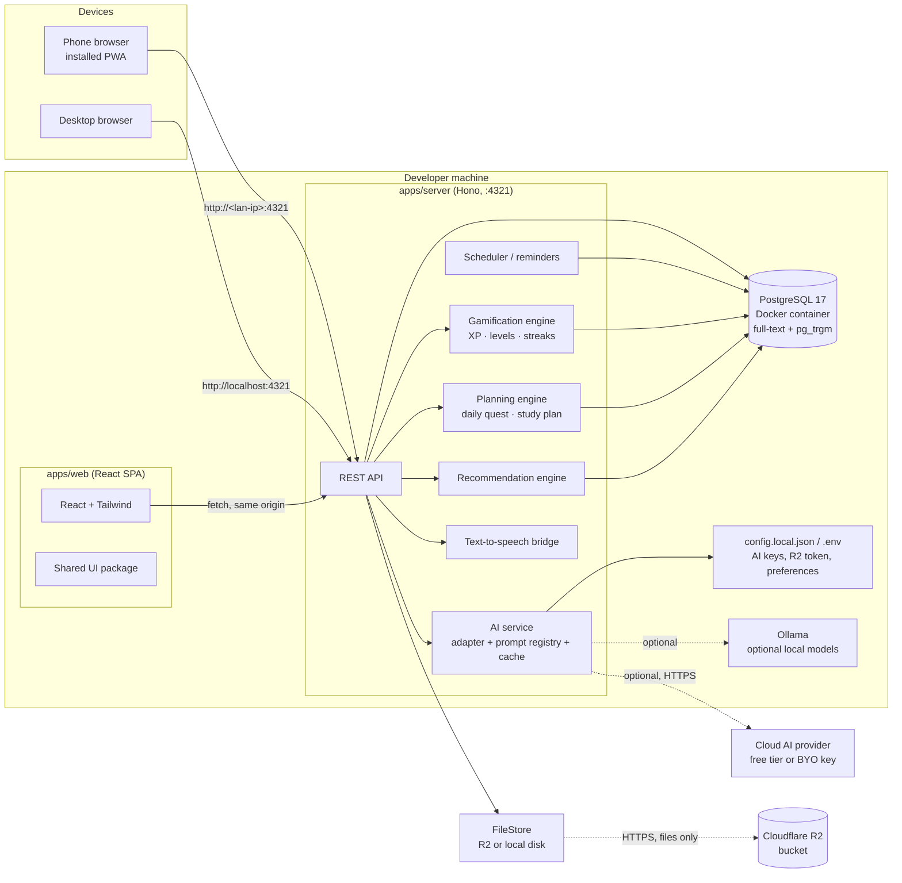
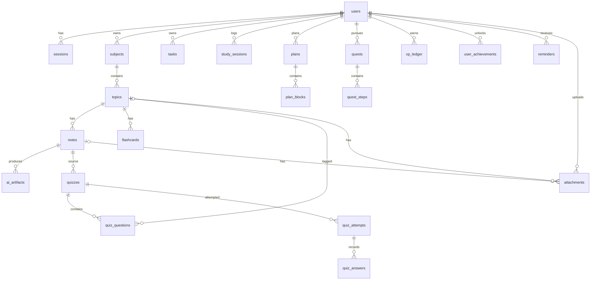

# Study Quest — Implementation Plan

Version 1.0 · Single source of truth for building Study Quest

This one document contains everything needed to build the product:

| Part                                   | Contents                                                                                                                                      |
| -------------------------------------- | --------------------------------------------------------------------------------------------------------------------------------------------- |
| **Part I — Design system** (§1–§13)    | Brand and logo usage, colour, typography, spacing, motion, layout, component inventory, theming, voice, accessibility                         |
| **Part II — Architecture** (§14–§22)   | Stack, system shape, repository layout, 26 architecture decisions, data model, API surface, AI layer, non-functional targets, technical risks |
| **Part III — Delivery plan** (§23–§30) | 23 phases in 6 milestones, with checklists, exit criteria, effort, traceability, risks and backlog                                            |

Product requirements: [PRD.md](PRD.md) · Original source document: `Study Quest PRD.docx`

**Decisions at a glance:** mobile-first PWA running entirely on one computer at zero cost ·
React + Vite + Hono + PostgreSQL (Docker) · Better Auth · Cloudflare R2 for files ·
provider-agnostic AI (local Ollama first) · everything else free and open source.

---

# Part I — Design system

This section is the single source of truth for how Study Quest _looks and feels_. Every screen
in the app must be assembled from the tokens and components defined here. If something is not
in this document, it does not ship — extend this document first.

---

## 1. Design principles

The five product principles (PRD §33) become five design rules:

| Principle                    | Design consequence                                                                                                                                                  |
| ---------------------------- | ------------------------------------------------------------------------------------------------------------------------------------------------------------------- |
| Learning comes first         | Gamification (gold, XP, streaks) is never more visually prominent than the learning action itself. No confetti on a screen where the student is reading.            |
| Simple but powerful          | Progressive disclosure. One primary action per screen. Secondary AI actions live in a single "AI actions" row on notes. Never more than 3 primary CTAs on a screen. |
| Everything connects          | Every screen answers "what's next?" — a persistent suggestion strip on Home and a "Next up" row after every completed activity.                                     |
| Students stay in control     | Anything auto-generated is visibly editable and clearly labelled ("Suggested by Study Quest"), never silently applied.                                              |
| Always answer "What's next?" | After quiz/flashcard/session completion, the result screen's primary button is the next logical action (e.g. _Retry weak topics_), not "Back to home".              |

Additional design rules:

- **Mobile-first.** The primary design target is a 390 × 844 phone. Desktop is an enhancement.
- **Calm, not childish.** Secondary-school and university students, not 8-year-olds. Rounded
  and warm, but restrained. No comic fonts, no mascot characters.
- **Progress is visible but not shaming.** Never show red for "behind". Use `sand-200` fills for
  zero-progress and the accent for achieved.
- **Restraint over decoration.** Colour is scarce on purpose (§3.0). A screen that needs a
  gradient to look finished has too many competing elements. If a screen feels busy, remove
  colour before removing content.

---

## 2. Brand

### 2.1 Logo concept

An **open book** (study) beneath a **four-point quest star** (reward, progress, the "quest" in
Study Quest), on a violet gradient tile. The book's white is the only pure white in the brand —
which is why every card in the app is also white, so the mark feels like it belongs.

**One mark, used everywhere.** The primary logo is `brand/logo-mark.svg`, and it is the _only_
logo in the product. The favicon and monochrome variants exist purely as technical
derivations of that one mark, not as alternative designs to choose between — the favicon is the
same drawing with the spine detail removed, because the spine is invisible below 32 px.

### 2.2 Files

| File                  | Status       | Use                                                                               |
| --------------------- | ------------ | --------------------------------------------------------------------------------- |
| `brand/logo-mark.svg` | **The logo** | Everywhere in the product: header, splash, login, app icon, favicon               |
| `brand/favicon.svg`   | Derivative   | Generated from the mark for ≤ 32 px (spine detail removed)                        |
| `brand/logo-mono.svg` | Derivative   | Single-colour fallback when the gradient cannot render — print, email, watermarks |

There is no wordmark lockup file. In the app, and in the repository header, the mark sits beside
an already-typeset product name at 8 px gap — a second baked-in wordmark would be redundant and
would fight the type.

### 2.3 Usage rules

- **Clear space:** keep at least the height of the gold star (≈ 25 % of the mark's height) free
  on all sides. Nothing enters the clear space.
- **Sizes:** 20 px inline beside a header title · 32 px in the top bar · 96–128 px on the splash
  and login screen · 512 px as the installed app icon.
- **Backgrounds:** white, `sand-50`, `sand-950`, or an ambient gradient wash. The mark's own
  gradient means it does not need a coloured plate around it.
- **Do not:** rotate, stretch, skew, outline, drop-shadow, recolour the star, flatten the
  gradient, place it on photography, or surround it with a second logo variant.
- **Beside text:** 8 px gap, baseline aligned so the mark's optical centre sits on the first
  line of text — never vertically centred against a two-line block.

### 2.4 App icon

PWA icons are generated from `brand/logo-mark.svg` by `scripts/generate-icons.mjs`:

```
public/icons/icon-192.png   public/icons/icon-512.png
public/icons/maskable-512.png   (20 % safe-area padding, solid iris-600 field)
apple-touch-icon.png
favicon.ico
```

---

## 3. Colour

All values are CSS custom properties in `packages/ui/src/styles/tokens.css` and are exposed to
Tailwind v4 through `@theme`. Never hard-code a hex value in a component.

> **Token names changed.** `indigo-*` → `iris-*`, `slate-*` → `sand-*`, semantic
> `success/warning/danger/info` → `ok-*/warn-*/bad-*`, and `violet-*` is folded into the accent.
> Migrate in one pass: `indigo-600` → `iris-600`, `slate-500` → `sand-500`, and so on. The
> subject palette is gone entirely (§3.5).

### 3.0 The one rule

**One accent hue. Everything else is a tint of it or a warm neutral.**

The previous palette had eight subject colours, four semantic colours, violet as a second brand
hue, and gold as a third. That is what made the app look like a generic AI product: colour
carrying no meaning, competing for attention, and turning every screen into a rainbow.

The new system inverts that. Colour is _scarce_, so when it appears it means something.

| Layer    | What it is                                      | How much                                |
| -------- | ----------------------------------------------- | --------------------------------------- |
| Accent   | One hue, `iris`                                 | Buttons, active states, progress, focus |
| Reward   | `gold`, used **only** for XP / levels / streaks | Rare — a few moments per session        |
| Neutrals | Warm greys (`sand`)                             | ~95 % of every screen                   |
| Status   | Three, desaturated                              | Only on error, overdue, and completion  |
| Ambient  | Very low-opacity accent gradients               | Decoration behind hero areas only       |

Gradients are **ambient only** — they sit behind headers, empty states and onboarding, blurred
and washed out. Never on a button, a progress bar, a chart series, or anything the user must
read. This is the single most important rule in this section: gradients are atmosphere, never
information.

### 3.1 Accent — Iris

A single violet-leaning hue, chosen to sit close to the logo gradient so the mark never fights
the interface.

| Token      | Value     | Use                                             |
| ---------- | --------- | ----------------------------------------------- |
| `iris-50`  | `#F7F5FF` | Tinted surface, hover on a card                 |
| `iris-100` | `#EEE9FE` | Selected row, progress track                    |
| `iris-200` | `#DDD3FE` | Border on a tinted surface                      |
| `iris-300` | `#C4B5FD` | Decorative gradient stop, disabled fill         |
| `iris-400` | `#A78BFA` | Decorative gradient stop, dark-theme accent     |
| `iris-500` | `#8B5CF6` | Ambient gradient midpoint                       |
| `iris-600` | `#7C3AED` | **Primary action**, active progress, focus ring |
| `iris-700` | `#6D28D9` | Primary hover / pressed                         |
| `iris-800` | `#5B21B6` | Accent text on light surfaces                   |
| `iris-900` | `#4C1D95` | Headings on light, dark-theme text              |
| `iris-950` | `#2E1065` | Dark-mode page background                       |

### 3.2 Reward — Gold

Unchanged in value, reduced in use.

| Token      | Value     | Use                             |
| ---------- | --------- | ------------------------------- |
| `gold-100` | `#FEF3C7` | Achievement tile background     |
| `gold-200` | `#FDE68A` | Star gradient start             |
| `gold-300` | `#FCD34D` | Gold star on dark               |
| `gold-400` | `#FBBF24` | Star gradient end, streak flame |
| `gold-500` | `#F59E0B` | XP bar fill, level badge        |
| `gold-600` | `#D97706` | XP text on light surfaces       |

**Gold rule:** gold is never a button, a link, a chart series or body text. If something is
gold, it is a reward. Text on gold is always `iris-950`. Gold appears on roughly one element per
screen — never on a whole card or a whole section.

### 3.3 Status — three, desaturated

Deliberately muted so a success state does not shout. Full-strength red and green are an
"AI dashboard" tell.

| Token      | Value     | Use                                            |
| ---------- | --------- | ---------------------------------------------- |
| `ok-500`   | `#0E9F6E` | Correct answers, completed quests, improvement |
| `ok-100`   | `#D1FAE5` | Tinted background for a correct answer         |
| `warn-500` | `#B45309` | Due soon, low mastery                          |
| `warn-100` | `#FEF3C7` | Tinted background for a warning                |
| `bad-500`  | `#DC2626` | Overdue, destructive action, wrong answer      |
| `bad-100`  | `#FEE2E2` | Tinted background for an error                 |

### 3.4 Neutrals — Sand

Warm greys, not blue-greys. The warmth is what makes the interface feel considered rather than
default, and it pairs with the pink-violet cast of the reference aesthetic.

| Token      | Value     | Use                            |
| ---------- | --------- | ------------------------------ |
| `sand-50`  | `#FAFAF9` | Page background                |
| `sand-100` | `#F5F5F4` | Subtle fill, track backgrounds |
| `sand-200` | `#E7E5E4` | Borders, dividers              |
| `sand-300` | `#D6D3D1` | Disabled borders               |
| `sand-400` | `#A8A29E` | Muted icons                    |
| `sand-500` | `#78716C` | Secondary text                 |
| `sand-600` | `#57534E` | Body text on light             |
| `sand-700` | `#44403C` | Strong body text               |
| `sand-800` | `#292524` | Headings on light              |
| `sand-900` | `#1C1917` | Dark card, dark text           |
| `sand-950` | `#0C0A09` | Dark page background           |

**Light theme surfaces:** page `sand-50` · card `#FFFFFF` · border `sand-200` · body `sand-700`
· muted `sand-500`.
**Dark theme surfaces:** page `sand-950` · card `sand-900` · border `#292524` ·
body `sand-100` · muted `sand-400`.

### 3.5 Subjects: no colour palette

The old eight-colour subject palette is **removed**. Subjects are distinguished by
**monogram, not hue** — a warm neutral avatar tile with the subject's initials, in the accent hue
only when the subject is the active one.

This is the change that most affects how the app looks. A list of subjects is now a list of
restrained, quiet tiles rather than a row of competing colours, and the eye goes to the one
subject in focus. Where a chart genuinely needs multiple series (subject progress over time),
the series use **tints of the single accent** — `iris-300` through `iris-700` — which stays
readable because the series are already separated by position and label.

### 3.6 Ambient gradients

The soft, out-of-focus colour washes from the reference aesthetic, used sparingly:

```css
/* Decorative only. Always aria-hidden, always low opacity, never behind body text. */
.ambient {
  position: absolute;
  inset: 0;
  z-index: -1;
  pointer-events: none;
  filter: blur(64px);
  opacity: 0.55;
  background:
    radial-gradient(40% 50% at 20% 15%, var(--iris-300) 0%, transparent 70%),
    radial-gradient(35% 45% at 85% 25%, #f9a8d4 0%, transparent 70%),
    radial-gradient(45% 55% at 60% 90%, var(--iris-400) 0%, transparent 70%);
}
```

Where it is allowed: onboarding, the empty state, the Home greeting, a completed quest, the
login screen. Where it is forbidden: task lists, quiz screens, note reading mode, the progress
tables, anywhere with dense data.

On light themes the opacity drops to ~.35 and tints shift to `iris-200` and rose-200 so it stays
subtle. Dark mode uses the same gradients at .45 over `sand-950`.

### 3.7 Contrast and accessibility

- Body text ≥ 4.5:1 against its background; large text and UI borders ≥ 3:1 (WCAG AA).
- No information is conveyed by colour alone. Every progress ring, status dot and mastery badge
  has a text label or icon.
- Reducing the palette must not reduce legibility: `sand-500` on white is 4.6:1 and is the
  lightest permitted body-adjacent text. Status colours are checked at their 600/700 values on
  tinted backgrounds, not their 400s.
- Dark mode is a first-class theme, not an afterthought: it is a Phase 1 deliverable.

---

## 4. Typography

**Two families, one job each.** Display and headings are a **serif**; UI and body are a
**sans**. This is the single biggest thing separating the app from a generic dashboard — a
study tool should read like something you would want to read in, not a form you fill in.

| Role                    | Family                                     | File                                                        | Fallback                                |
| ----------------------- | ------------------------------------------ | ----------------------------------------------------------- | --------------------------------------- |
| Display, h1–h3          | **Fraunces** (variable, optical size axis) | `packages/ui/src/styles/fonts/fraunces-latin.woff2` (66 KB) | Georgia, Times New Roman, serif         |
| UI, body, caption, stat | **Inter** (variable)                       | `packages/ui/src/styles/fonts/inter-latin.woff2` (47 KB)    | system-ui, Segoe UI, Roboto, sans-serif |

Both are self-hosted, `latin` subset, served as `woff2-variations`, `font-display: swap`. **No
web-font CDN** — the app must work offline, and a font request to a third party would leak a
usage signal (§14 constraint 6).

**Why this pairing:** Fraunces is a variable serif with an optical-size axis, so it stays
readable at 19px while keeping its character at 40px, and it is warm rather than austere — right
for a student audience that the product principles explicitly exclude from being childish. Inter
does the small text, where personality is worth less than legibility.

| Style token | Size / line-height | Weight       | Family | Use                                                  |
| ----------- | ------------------ | ------------ | ------ | ---------------------------------------------------- |
| `display`   | 40 / 44            | 500          | serif  | Home greeting, the one hero line per screen          |
| `h1`        | 32 / 38            | 500          | serif  | Screen titles                                        |
| `h2`        | 25 / 32            | 500          | serif  | Section headings                                     |
| `h3`        | 19 / 26            | 600          | serif  | Card titles, subject names                           |
| `body-lg`   | 18 / 31            | 400          | sans   | Note body on mobile                                  |
| `body`      | 16 / 26            | 400          | sans   | Default UI text                                      |
| `body-sm`   | 14 / 21            | 400          | sans   | Secondary text, helper text                          |
| `caption`   | 11 / 14            | 500          | sans   | Badges, meta, timestamps (uppercase only for badges) |
| `stat`      | 24 / 29            | 600, tabular | sans   | XP, scores, timers                                   |

**Rules that come with a serif:**

- **Serif sits optically smaller.** Display sizes are a step up (40 rather than 32) to match a
  sans at the same perceived size.
- **Serif sits optically heavier.** Heading weights drop to 500; a 600 serif reads as heavy
  where a 600 sans reads as normal.
- **Tracking tightens upward.** `-.03em` at display, `-.025em` at h1, `-.02em` at h2. Serif
  sidebearings are generous and look loose when tracked out.
- **Optical size axis.** Set `font-variation-settings: "opsz"` to match the rendered size —
  9 for display, 32 for h3 — so thin strokes do not go spindly at small sizes.
- **The serif never goes below 19px.** Below that, use sans. This is a hard rule, not a
  preference: small serif is the fastest way to make an interface look broken.
- **Numerals stay in the sans.** `stat` is Inter with tabular figures — lining figures in a
  text serif are harder to align in a column of scores.
- **Measure:** 60–75 characters for note and summary text; UI text is not width-constrained.
- **Note editor:** `body-lg` (sans), 1.7 line-height, max-width 70ch.
- **Science notation:** support `x²`, `H₂O`, `CO₂` via a small `sub`/`sup` helper in the note
  renderer — math is a core use case (P5).
- Uppercase is reserved for `caption` badges. Never uppercase body text.

---

## 5. Spacing, radius, elevation

**Spacing** — 4 pt base: `0, 1(4), 2(8), 3(12), 4(16), 5(20), 6(24), 8(32), 10(40), 12(48), 16(64)`

- Screen padding: 16 (mobile) / 24 (≥ 768).
- Card padding: 16–20. Card gap: 12–16. Section gap: 32.
- Minimum touch target: 44 × 44.

**Radius** — `sm 8` (chips, inputs) · `md 12` (buttons, cards) · `lg 16` (large cards, sheets)
· `xl 24` (modals, hero tiles) · `2xl 32` (celebration cards) · `full` (avatars, pills)

**Elevation**

| Token | Use                                                                             |
| ----- | ------------------------------------------------------------------------------- |
| `e0`  | Flat — cards on `sand-50` use a border, no shadow                               |
| `e1`  | Resting cards: `0 1px 2px rgb(15 23 42 / 0.06), 0 1px 3px rgb(15 23 42 / 0.10)` |
| `e2`  | Raised: sticky headers, floating action button                                  |
| `e3`  | Popovers, dropdowns, active drag                                                |
| `e4`  | Modals and sheets only                                                          |

**Focus ring** — `0 0 0 2px <surface>, 0 0 0 4px iris-600`. Always visible on keyboard focus,
never removed without a replacement.

---

## 6. Iconography

- **Set:** Lucide (MIT, tree-shakeable), 24 × 24 grid, `stroke-width 1.75`, rounded caps.
- Sizes: 16 (inline, badges), 20 (default UI), 24 (navigation, empty states), 32 (feature icons).
- Icons never carry meaning alone next to a label; the label is the source of truth.
- Product-specific icons are custom SVGs in `packages/ui/src/icons/`, following the same
  24 × 24 grid and 1.75 stroke: `quest-flag`, `star-quest`, `streak-flame`, `xp-bolt`,
  `level-shield`, `topic-node`.

---

## 7. Motion

| Token        | Duration | Easing                              | Use                                   |
| ------------ | -------- | ----------------------------------- | ------------------------------------- |
| `instant`    | 100 ms   | `cubic-bezier(0.2, 0, 0, 1)`        | Press feedback, toggles               |
| `fast`       | 150 ms   | same                                | Hover, small reveals                  |
| `base`       | 200 ms   | same                                | Sheets, dropdowns, card lift          |
| `slow`       | 300 ms   | `cubic-bezier(0.16, 1, 0.3, 1)`     | Page transitions, progress fills      |
| `deliberate` | 500 ms   | `cubic-bezier(0.34, 1.56, 0.64, 1)` | XP bar fill, level-up, quest complete |

- **Reduced motion:** `prefers-reduced-motion: reduce` collapses all durations to 0 ms except
  opacity fades (100 ms), and replaces the level-up animation with a static badge.
- Celebration animation (confetti) is capped at 600 ms, fires once, and is skipped entirely in
  reduced-motion mode.
- The quiz runner and focus timer animate progress only — never the question text — to avoid
  visual noise during study.

---

## 8. Layout and navigation

**Breakpoints** — `sm 640 · md 768 · lg 1024 · xl 1280 · 2xl 1536` (mobile-first, min-width)

**Navigation**

- **Mobile (< 1024):** bottom tab bar with the five PRD sections — Home, Tasks, Study, Quests,
  Progress. A centre FAB on Home is replaced by quick actions in a sheet; the tab bar never
  grows a sixth item.
- **Desktop (≥ 1024):** left rail (72 px collapsed, 240 px expanded) with the same five items,
  plus a secondary top bar for search and settings.
- Header: title + contextual primary action only. No more.

**Page templates**

1. **Dashboard** — progress strip, Today's Quest, Continue Learning, Upcoming, Quick Actions.
2. **List** — filter chips + sortable list (Tasks, Quests, Topics, Flashcard decks).
3. **Detail** — hero header + tabs (Notes / Quizzes / Flashcards / Tasks) + activity.
4. **Theatre** — distraction-free full-bleed mode for Quiz, Flashcards, Read My Notes and Focus
   sessions. No navigation chrome; a single escape affordance.
5. **Settings** — grouped list of setting panels.

**Grid** — 4 columns mobile, 8 at ≥ 768, 12 at ≥ 1280, 20 px gutter, 1440 px max content width
(readable columns capped at 720 px for text).

---

## 9. Component inventory

Every component below ships with Storybook stories covering default, hover, active, focus,
disabled, loading, error and empty states.

**Actions** — Button (primary / secondary / ghost / danger / gold-reward, sm / md / lg, loading
spinner), IconButton, FAB, SegmentedControl, Chip (filter, removable, subject tag), Link.

**Inputs** — TextInput, Textarea, RichNoteEditor, Select, Combobox (subject/topic picker),
DatePicker, TimePicker, Slider (difficulty), Toggle, Checkbox, Radio, SegmentedChoice
(summary length/format, quiz options), SearchInput, FileInput (Phase 22).

**Data display** — Card, StatTile, ProgressBar, ProgressRing (0–100 %, ARIA value), XpBar
(gold), LevelBadge, StreakFlame, Badge/AchievementTile, SubjectCard, TopicRow, MonogramTile,
EmptyState, Skeleton, Table (progress history), ListRow.

**Domain components** — NoteCard, NoteActionBar, SummaryPanel, ExplanationCard, QuizRunner,
QuizOption, QuizResultDonut, WeakTopicList, Flashcard, FlashcardDeckCard, DeckStudyProgress,
FocusTimer, SessionStepList, TaskRow, TaskComposer, RecurrenceEditor, PlanDayView, QuestCard,
QuestStepper, DailyQuestList, LevelUpToast, StreakCalendar.

**Overlays** — Modal, BottomSheet, Drawer, Popover, Tooltip, Toast (with `aria-live="polite"`),
ConfirmDialog, CommandPalette (⌘K, global search).

---

## 10. Theming

- Tokens are CSS custom properties on `:root`, overridden under `.dark`.
- Default follows the OS (`prefers-color-scheme`); the user's explicit choice in Settings wins
  and is stored in `localStorage` + the `settings` table.
- Theme switch is a three-state control: System / Light / Dark.
- Charts must be readable in both themes; series colours are theme-aware tokens, not literals.
  Multi-series charts use **tints of the single accent** (`iris-300` → `iris-700`), never a
  multi-hue palette — the series are already separated by position and label (§3.5).

---

## 11. Voice and microcopy

- **Tone:** encouraging, direct, second person. "Let's review Motion" — not "You failed to
  review Motion".
- **No guilt, ever.** Overdue states say "Due Friday" and offer a reschedule, never shame.
- **Labels AI output.** Anything the model generated carries a subtle "AI" badge with a
  tooltip stating it came from the student's own notes.
- **Errors say what to do next:** "We couldn't reach the AI service. Your notes are safe —
  try again or continue offline."
- **Numbers are friendly:** scores as "7 of 10" alongside "70 %"; XP as "+50 XP" with a
  one-line reason.

---

## 12. Accessibility requirements (definition of done for every screen)

- Keyboard reachable and operable; visible focus ring everywhere; logical tab order.
- Touch targets ≥ 44 × 44 px; primary actions reachable in the bottom third on mobile.
- Progress components expose `role="progressbar"` with `aria-valuenow`, or a visually hidden
  text equivalent ("Physics 68 %").
- Quiz runner announces the question and each result via a live region; supports
  `1`–`4` to select options and `Enter` to submit.
- Colour is never the only signal (§3.7).
- `prefers-reduced-motion` honoured (§7).
- Text meets AA contrast in both themes.
- Full dark-mode rendering is part of the DoD, not a follow-up.

---

## 13. Delivery

| Concern    | Mechanism                                                                  |
| ---------- | -------------------------------------------------------------------------- |
| Tokens     | `packages/ui/src/styles/tokens.css` → Tailwind v4 `@theme`                 |
| Components | `packages/ui` (React, no app dependencies), consumed via workspace import  |
| Catalogue  | Storybook, run with `pnpm storybook`, deployed to a private local port     |
| Icons      | `lucide-react` + custom SVGs, tree-shaken                                  |
| Fonts      | Self-hosted Inter variable, preloaded, `font-display: swap`                |
| App icon   | Generated from `brand/logo-mark.svg` by a build script                     |
| Review     | Every new component needs a Storybook story and an a11y check before merge | --- |

# Part II — Architecture

---

## 14. Context and constraints

**The app and the database run locally on the developer's computer.** This is the current,
deliberate posture: the Node server, the PostgreSQL instance and the PWA all live on one
Windows machine, started with one command. There is no cloud deployment. The only exception is
file storage (Cloudflare R2), which is a chosen, isolated dependency — see ADR-027.

These drove every decision below:

1. **The app and database run locally.** One command starts the database container and the
   server. No cloud hosting, no deploy pipeline, nothing to keep running elsewhere. Access is
   from this machine, and optionally from a phone on the same Wi-Fi.
2. **Zero recurring cost.** Every dependency is free, open source, or local. The one external
   service, Cloudflare R2, has a free tier (§14.2) and the app degrades gracefully without it.
3. **Single user, single device owner** — but the data model is multi-user from day one so it
   can move to a server later without a rewrite.
4. **Mobile-first PWA.** The primary interface is a phone; the same build runs on desktop.
5. **AI features are the product's differentiator**, and must work with whatever model the user
   has — a local Ollama model at zero cost, or any cloud provider key.
6. **Student data is sensitive.** Notes are the student's own words. Nothing leaves the machine
   except an explicit AI request and any file the user deliberately uploads. No telemetry, no
   analytics, no third-party scripts.

### 14.1 Chosen stack

Named and decided — these are the project's technology choices.

| Layer              | Choice                                                                       | Cost       | Runs where          |
| ------------------ | ---------------------------------------------------------------------------- | ---------- | ------------------- |
| **App framework**  | **React 19 + TypeScript + Vite** (SPA, PWA)                                  | Free       | Local               |
| **Database**       | **PostgreSQL 17** in Docker, with Drizzle ORM                                | Free       | **Local container** |
| **Authentication** | **Better Auth** (email + password, session cookies)                          | Free       | Local               |
| **File storage**   | **Cloudflare R2** (S3-compatible object storage)                             | Free tier  | Cloud               |
| Runtime            | Node.js 22 LTS                                                               | Free       | Local               |
| Package manager    | pnpm workspaces                                                              | Free       | —                   |
| Styling            | Tailwind CSS v4 + CSS variable tokens                                        | Free       | —                   |
| Routing            | React Router                                                                 | Free       | —                   |
| Server             | Hono on Node (`@hono/node-server`)                                           | Free       | Local               |
| Validation         | Zod (shared contracts)                                                       | Free       | —                   |
| Server state       | TanStack Query                                                               | Free       | —                   |
| UI state           | Zustand                                                                      | Free       | —                   |
| AI                 | Provider adapters: Ollama (local) / Gemini / Groq / OpenAI-compatible / mock | Free tiers | Local or cloud      |
| Speech             | Web Speech API (browser)                                                     | Free       | Browser             |
| Search             | PostgreSQL full-text search + `pg_trgm`                                      | Built in   | Local container     |
| Components         | Storybook                                                                    | Free       | Local               |
| Tests              | Vitest + React Testing Library + Playwright                                  | Free       | Local               |
| PWA                | vite-plugin-pwa                                                              | Free       | —                   |
| Containerisation   | Docker (database only)                                                       | Free       | Local               |

The same decisions, with the reasoning behind each one, are also recorded in
[PRD.md Appendix A](PRD.md#appendix-a--notes-technical-approach-and-decisions).

### 14.2 The one external service: Cloudflare R2

Chosen for file storage (photos, PDFs, exports). Everything else is local.

|                     |                                                                                                                           |
| ------------------- | ------------------------------------------------------------------------------------------------------------------------- |
| Free tier           | 10 GB-month storage · 1M Class A (write) operations/month · 10M Class B (read) operations/month · **free egress**         |
| Paid beyond that    | $0.015/GB-month, $4.50/M writes, $0.36/M reads — so the failure mode is a small bill, never a large one                   |
| Requirement         | A free Cloudflare account and an R2 API token                                                                             |
| Credential handling | Token lives in `config.local.json` (git-ignored), server-side only                                                        |
| Offline behaviour   | Attachments are unavailable offline; the app shows a clear "reconnect to view" state and never blocks the rest of the app |
| Fallback            | A `FileStore` interface with a local-disk implementation, so the app is fully usable with zero configuration (ADR-027)    |

**Privacy consequence to be explicit about:** with R2 configured, uploaded files leave the
machine. The app must therefore never auto-upload anything, show a clear file-storage indicator
in Settings, and state plainly in the privacy page which files are stored off-device.

---

## 15. System shape



**In production mode there is exactly one Node process.** The server serves the built SPA and the
API on the same port, so there are no CORS issues and no second terminal to manage. The only
container is the PostgreSQL database (ADR-028, ADR-029). **In development**, `docker compose up
-d db` keeps the database up while Vite runs on 5173 and proxies `/api` to 4321 with hot reload.

**What runs where, at a glance**

| Component            | Location                                          |
| -------------------- | ------------------------------------------------- |
| Web app (PWA)        | Local — browser, installed to phone over LAN      |
| API + engines        | Local — Node process on `:4321`                   |
| Database             | Local — PostgreSQL 17 in Docker, `localhost:5432` |
| Authentication       | Local — Better Auth, sessions in PostgreSQL       |
| AI provider          | Local (Ollama) or cloud, per user choice          |
| Files (photos, PDFs) | Cloudflare R2, with a local-disk fallback         |

---

## 16. Repository layout

```
study-quest/
├─ apps/
│  ├─ web/                     # React PWA
│  │  ├─ public/               # icons, manifest, service worker (generated)
│  │  └─ src/
│  │     ├─ app/               # router, providers, layout shell
│  │     ├─ features/          # one folder per PRD section
│  │     │  ├─ home/  tasks/  study/  quests/  progress/
│  │     │  ├─ notes/  quizzes/  flashcards/  sessions/
│  │     │  └─ gamification/  search/  settings/
│  │     ├─ lib/               # api client, query client, hooks
│  │     └─ styles/            # font, global css
│  └─ server/                  # Hono API + engines
│     └─ src/
│        ├─ routes/            # one router per domain
│        ├─ services/          # gamification, planning, recommendations, tts, files
│        ├─ ai/                # adapters, prompts, schemas, cache
│        ├─ db/                # drizzle client + migrations + connection pool
│        ├─ auth/              # Better Auth server + session middleware
│        ├─ storage/           # FileStore: R2 adapter + local-disk adapter
│        ├─ scheduler/         # cron-ish local scheduler
│        └─ index.ts
├─ packages/
│  ├─ core/                    # domain logic shared by both apps
│  │  └─ src/
│  │     ├─ gamification/      # xp, levels, streaks, achievements
│  │     ├─ progress/          # topic & subject progress formulas
│  │     ├─ planning/          # daily quest + study plan generation
│  │     ├─ recurrence/        # rrule-lite engine
│  │     └─ schemas/           # Zod contracts (API + AI)
│  ├─ db/                      # drizzle schema, migrations, seed
│  │  └─ src/schema/*.ts
│  └─ ui/                      # design-system components + tokens + Storybook
├─ brand/                      # logo + brand assets
├─ docs/                       # PRD and this plan
├─ scripts/                    # setup, dev, backup, db tasks, icon generation
├─ db/                         # local Postgres helpers (git-ignored)
│  ├─ init.sql                 # database, role, extensions
│  └─ seed.sql                 # optional bootstrap data
├─ data/                       # local file-storage fallback + backups (git-ignored)
└─ config.local.json           # DATABASE_URL, AI keys, R2 credentials (git-ignored)
```

**Rule:** `packages/core` and `packages/db` never import from `apps/*`. `packages/ui` never
imports from anything else. Dependencies point inward only.

---

## 17. Architecture decision records

Each ADR records the decision, the reason, and what it costs us. Full detail lives in
`docs/decisions/ADR-XXX.md` when a decision is revisited.

### ADR-001 — The app and database run locally

**Decision.** The Node server and a local PostgreSQL instance both run on one Windows machine.
The app is unusable without that machine running, by design. There is no cloud deployment.
**Why.** Zero hosting cost, no accounts needed, notes stay on the machine, works offline, and
the whole system is inspectable by one person.
**Cost.** No multi-device sync, no always-on reminders when the PC is off, single point of
failure. Mitigated by ADR-022 (automated local backups) and by keeping the data model
multi-user so ADR-026 can move it later without a rewrite.

### ADR-002 — React + Vite SPA, not Next.js

**Decision.** Client-side SPA served by the Hono server; no SSR.
**Why.** The app is 100 % behind a login on a private network, so there is no SEO or public-page
requirement. A Vite SPA is faster to build, faster to run locally, and has no server-rendering
cold-start cost. Next.js would only add a second rendering model to maintain.
**Cost.** No SSR/OG previews. Acceptable for a private study tool.

### ADR-003 — PostgreSQL (local) + Drizzle ORM

**Decision.** PostgreSQL 17, running in a Docker container on `localhost:5432`, database
`studyquest`, with Drizzle ORM for typed queries and real SQL migrations. Search uses
PostgreSQL full-text search with `pg_trgm` (ADR-013). Files are not stored here (ADR-027).
Container setup is ADR-028.
**Why.** It is the right tool for a heavily relational domain — subjects → topics → notes →
quizzes → attempts → answers, with constraints, unique keys for XP idempotency, joins for
progress rollups, and `jsonb` for AI artifacts and settings. Postgres is also the destination
if the app is ever hosted (ADR-026), so choosing it now avoids a migration later. It is free and
runs entirely on this machine.
**Cost.** A running database process to install, start, secure and back up — real operational
overhead that SQLite avoided. Mitigated by ADR-028 (scripted setup, auto-start, `pg_dump`
backups) and by Drizzle keeping the access layer portable. Also: `postgres` types must be kept
strict (`text` + `check` rather than loose `any`), and connections must be pooled.

### ADR-004 — Hono API server

**Decision.** One Hono app on Node, serving `/api/*` and (in production) the static SPA.
**Why.** TypeScript end to end, tiny surface, first-class Zod validation, easy to add a
WebSocket or SSE route for streaming AI output.
**Cost.** We own the server lifecycle; solved by the dev launcher script and a scheduled
Windows task for auto-start.

### ADR-005 — npm/pnpm workspaces, four packages

**Decision.** `apps/web`, `apps/server`, `packages/core`, `packages/db`, `packages/ui`.
**Why.** Separates domain logic from UI and from persistence, so AI-assisted changes touch one
layer at a time. `core` being pure and framework-free means the planning and XP rules are
unit-testable without a browser or a database.
**Cost.** Build configuration overhead. Minimum viable subset is `web + server + core`; if that
proves too heavy, collapse `db` into `server` first.

### ADR-006 — Provider-agnostic AI adapter layer

**Decision.** One internal `AiProvider` interface; adapters for Ollama, Gemini, Groq,
OpenAI-compatible endpoints (OpenRouter, Together, local vLLM) and a deterministic `mock`.
Provider is selected per request from settings.
**Why.** The cheapest model today may not be available tomorrow, and users bring their own
keys. Swapping providers must never touch feature code.
**Cost.** Slight extra abstraction up front.

```ts
interface AiProvider {
  name: string;
  complete<T>(req: AiRequest<T>): Promise<AiResult<T>>; // structured output
  stream?(req: AiRequest): AsyncIterable<string>; // long-form text
  health(): Promise<{ ok: boolean; model?: string; detail?: string }>;
}
```

### ADR-007 — Provider order: local first

**Decision.** Default order: **Ollama** (free, offline, private) → **free cloud tier** (Gemini
Flash-Lite, Groq) → **user's own key** for paid providers. If no provider is configured, the app
runs in **offline mode**: every feature except AI generation works, and AI actions show a
"connect a model" prompt with setup instructions.
**Why.** Truly zero cost, no key required to evaluate the product, and students' notes never
leave the machine if they choose local models.
**Cost.** Local model quality varies; the app must degrade gracefully.

### ADR-008 — Artifact cache and prompt versioning

**Decision.** Every AI result is stored in `ai_artifacts` with
`(kind, source_id, input_hash, options, prompt_version, provider, model)` as the cache key.
**Why.** Re-generating a summary costs money and time for no reason. Caching also makes results
reproducible and lets us A/B prompt versions.
**Cost.** A stale note should invalidate its artifacts — handled by hashing note content into
`input_hash`.

### ADR-009 — Structured output via JSON Schema

**Decision.** Quizzes, flashcards, plans, recommendations and mastery tags are requested as JSON
matching a Zod-derived schema, then validated. Free-form summaries and explanations are text.
**Why.** A quiz is unusable if the model returns prose. Validation + one repair retry turns a
best-effort response into a guarantee.
**Cost.** Slightly higher token cost; occasional repair call.

### ADR-010 — Zod contracts shared everywhere

**Decision.** Request/response types live in `packages/core/src/schemas` and are used by the
server routes, the API client and the forms.
**Why.** One definition, no drift between client and server; free runtime validation on both
sides.

### ADR-011 — TanStack Query + Zustand

**Decision.** Server state (notes, tasks, progress) in TanStack Query with query keys per
domain. Ephemeral UI state (open sheet, current quiz answer, timer state) in Zustand.
**Why.** Separating "data from the server" from "what the UI is doing now" prevents the most
common source of bugs in apps of this size. Derived state (progress %, level) is computed, never
stored twice.

### ADR-012 — Local authentication

**Decision.** Better Auth running server-side in the Node process, with email + password,
scrypt/argon2 hashing, opaque session tokens in an httpOnly, SameSite=Lax cookie, and sessions
stored in PostgreSQL. A LAN PIN guards access when the server is exposed to the network.
**Why.** It is a mature, open-source (MIT) auth library purpose-built for exactly this shape —
self-hosted, database-backed sessions, no third-party service. It removes the need to
hand-roll password hashing, session rotation, and remember-me, all of which are easy to get
subtly wrong, while keeping every byte of credential data local and costing nothing.
**Cost.** A real dependency whose schema and API we must track; we still own the LAN PIN, route
rate-limiting, and the decision of which endpoints require a session. Its admin/plugin surface
is large, so we enable only what we need (email+password, and later passkey or OAuth if wanted).

### ADR-013 — PostgreSQL full-text search for search

**Decision.** A `search_index` table maintained by database triggers on notes, tasks, quizzes,
questions, flashcards, subjects and topics, queried with a `tsvector` column
(`to_tsvector('english', …)`) plus `pg_trgm` for typo and prefix tolerance ("Newt" finds
"Newton"). Results ranked with `ts_rank` and grouped by entity type.
**Why.** PRD §29 asks for search across every entity. Postgres gives ranked, typo-tolerant
search with no extra service, and the same code runs unchanged if the database is ever hosted.
`pg_trgm` is enabled in the container image (ADR-028), so the extension is part of the pinned
setup rather than a manual step.
**Cost.** Triggers must be kept in sync with migrations, `tsvector` must be regenerated on
update, and `pg_trgm` indexes cost write throughput and disk — irrelevant at this scale.

### ADR-014 — Web Speech API for Read My Notes

**Decision.** Browser `speechSynthesis` for "read aloud", with a `TtsProvider` interface so a
server TTS (or local Piper) can replace it later. Word-boundary events drive follow-along
highlighting.
**Why.** Free, no API key, no cost, works offline on most devices.
**Cost.** Voice quality and language support vary by platform; sentence-level highlighting
fallback needed where boundary events are missing.

### ADR-015 — XP as an append-only ledger

**Decision.** All XP is written to `xp_ledger` with a unique key on
`(user_id, reason, source_type, source_id)` so awarding is idempotent. Level and total XP are
derived from the ledger, never incremented in place.
**Why.** Retries, double-clicks, sync and bugs must never inflate XP. A ledger can be audited,
replayed and recomputed.
**Cost.** An extra table and a small recompute job.

### ADR-016 — Progress is computed, then cached

**Decision.** Topic and subject progress are calculated by `packages/core/progress` from
sessions, quiz mastery, review coverage and quest completion, and written to a `progress_cache`
column for cheap reads. Recomputed on the events that affect it.
**Why.** PRD §24–25 require a meaningful percentage, and a stored number that drifts from the
data is worse than a computed one.
**Cost.** Cache invalidation logic; mitigated by recomputing from the ledger on every write.

### ADR-017 — Recurrence in the server scheduler

**Decision.** Recurring tasks store a small rrule-lite (`freq`, `interval`, `byWeekday`,
`until`). A local scheduler materialises occurrences for the next 14 days and fires reminders.
**Why.** No cron daemon, no cloud scheduler, works with the machine off (catches up on next
start).
**Cost.** Limited to the recurrence patterns students actually use.

### ADR-018 — PWA with offline read

**Decision.** `vite-plugin-pwa` precaches the app shell and previously visited content. Writes
made offline are queued in IndexedDB and replayed on reconnect.
**Why.** Students lose connectivity constantly (commute, library, exams). The app must at least
open and show their data.
**Cost.** Cache invalidation complexity; mitigated by a network-first strategy for data and
cache-first for the shell.

### ADR-019 — Tailwind v4 with CSS variable tokens

**Decision.** Design tokens are CSS custom properties defined once and exposed to Tailwind via
`@theme`. Components use semantic utilities (`bg-surface`, `text-muted`), never raw colours.
**Why.** Keeps the design system (Part I) and the code in sync, and makes dark
mode a variable swap.
**Cost.** Requires discipline; enforced by lint rule banning arbitrary hex values.

### ADR-020 — Storybook as the component catalogue

**Decision.** Every component in `packages/ui` has stories for all eight states; Storybook runs
locally on port 6006.
**Why.** Design quality is a stated product principle ("simple but powerful"); a catalogue is
the only way to keep 40+ components consistent.

### ADR-021 — Test stack

**Decision.** Vitest for `core` logic (XP, progress, planning, recurrence) and server services;
React Testing Library for components; Playwright for a handful of end-to-end journeys
(create subject → add note → summarise → quiz → earn XP).
**Why.** The risky code is the rules engine and the AI output validation, both of which are
cheap to test in isolation. E2E is reserved for the five journeys that define the product.

### ADR-022 — Automated local backups

**Decision.** `scripts/db-backup.ps1` runs `docker compose exec -T db pg_dump -Fc` into
`data/backups/studyquest-YYYYMMDD-HHmmss.dump` (keeping the last 14) and can export a full
`.zip` of the database, the local file folder and a config template. Restore is `pg_restore`.
R2 is the one exception: uploaded files are backed up by the provider, and the export includes a
manifest of R2 object keys so a bucket sync is reproducible.
**Why.** A container's named volume is just as easy to lose as a data folder — and easier to
delete by accident with `docker compose down -v` — so backups must be automated, not manual.
**Cost.** Manual discipline; mitigated by a scheduled Windows task, a "last backup" indicator in
Settings, and a restore drill in P22.

### ADR-023 — Security posture

**Decision.** The server binds `127.0.0.1` by default. LAN access is an explicit opt-in in
Settings that also requires a 4-digit app PIN for unlocking. The local database listens on
loopback with a dedicated role and a generated password, and is never exposed on the network.
Credentials — AI provider keys and the R2 API token — live in `config.local.json`
(git-ignored, never sent to the browser; R2 keys are write-only in the UI). No analytics, no
telemetry, no third-party scripts, no CDN fonts. CORS is same-origin only.
**Why.** Student notes, paid API keys, and now an R2 token that can read and delete a bucket
are all reachable from this machine.
**Cost.** Remote access from outside the home network is not supported without extra work
(a tunnel would break the "no accounts, no cost" rule). R2 credentials mean the app is not
fully offline-capable once files are used — hence the local-disk fallback (ADR-027).

### ADR-024 — Windows ergonomics

**Decision.** PowerShell scripts for `setup`, `dev`, `start`, `db:up`, `db:down`, `db:migrate`,
`db:seed`, `db:backup`, `db:restore`, and `install-autostart` (a scheduled task at logon that
starts Docker Desktop, the database container, and the Node server). Paths are resolved relative
to the repo root; no absolute paths are committed. The local-disk file fallback lives in
`data/`.
**Why.** The target machine is Windows, and the app now supervises a container plus a Node
process — the user should never have to remember that, nor type a Docker command.

### ADR-025 — Cost guardrails

**Decision.** The server tracks token usage and estimated cost per request in
`ai_artifacts`, exposes a monthly estimate in Settings, enforces a per-user daily AI call cap,
and caches aggressively (ADR-008). Default prompts are tuned for small models. R2 usage is
surfaced in Settings with a warning at 80 % of the free tier.
**Why.** The whole point of the free stack is that it stays free; a runaway loop must not
produce a surprise bill on either the AI provider or R2.

### ADR-026 — Reversibility

**Decision.** Every layer is swappable behind an interface: local PostgreSQL→hosted Postgres
(same dialect, same Drizzle schema), `FileStore` R2→local disk or any S3-compatible provider,
Ollama→any AI provider (ADR-006), local server→hosted (same API), SPA→wrapped native app
(Capacitor, same build).
**Why.** The plan should not create a dead end if the app later needs to be public — and
choosing Postgres and S3-compatible R2 now is precisely what keeps that door open.

### ADR-027 — Cloudflare R2 for file storage

**Decision.** Uploaded files (photos, PDFs, exports) are stored in a private Cloudflare R2
bucket via its S3-compatible API, behind a `FileStore` interface with a local-disk
implementation as the default when R2 is not configured. The database stores only metadata and
the object key (§18.1 `attachments`).
**Why.** R2 has a genuinely usable free tier — 10 GB-month storage, 1M writes, 10M reads and
**no egress fees** — and an S3-compatible API, so it will not lock the app in. It is also the
only part of the system that genuinely benefits from being off-machine: large study documents
and photos do not bloat local backups, and the app can serve them to a phone over LAN without
streaming everything through the PC.
**Cost.** This is a cloud dependency and it is the one place student content leaves the
machine. It requires a Cloudflare account and a token, it is unusable offline, and if R2 is
misconfigured the app must degrade rather than break — hence the interface and the local-disk
default. Attachments are therefore opt-in: the app never uploads anything without an explicit
user action, and Settings states plainly which files live off-device.

### ADR-028 — PostgreSQL runs in Docker

**Decision.** PostgreSQL 17 runs as a container defined in `docker-compose.yml`
(`postgres:17-alpine`), bound to `127.0.0.1:5432` only, with a named volume (`sq_pgdata`)
holding the data directory, a healthcheck, and credentials from `.env`. Everything else — the
Node server, the Vite dev server — still runs natively on Windows. The only container is the
database.
**Why.** Docker is the cleanest way to run _the_ PostgreSQL — the exact version, the exact
extensions (`pg_trgm`), the same configuration on any machine — without installing a Windows
service, worrying about registry entries, or leaving a database running after the project is
abandoned. `docker compose down -v` gives a clean delete of all data, which is a genuine
advantage for a local-first project. It also keeps the PostgreSQL version pinned in the repo, so
the app cannot silently break when a service updates itself.
**Cost.** Docker Desktop must be installed and running, which is a heavyweight dependency on
Windows (it needs WSL 2, and it is the largest thing installed on the machine). Two processes
to start, though only one is a container. Mitigation: `scripts/setup.ps1` checks for Docker and
fails with the exact install command; `scripts/dev.ps1` waits for the database healthcheck before
starting the server; and `install-autostart.ps1` starts Docker Desktop and the container at
logon. If Docker is unacceptable, the documented fallback is a native PostgreSQL install with
the same `DATABASE_URL` — nothing in the code changes.

### ADR-029 — One container, not a containerised stack

**Decision.** Only PostgreSQL is containerised. The app server runs natively via `pnpm`, in
development and in production.
**Why.** A fully containerised stack (app + web + db) would be the "textbook" answer, but on
Windows it means slower file watching over bind mounts, worse hot reload, and a slower edit →
see-it loop — for no benefit, since there is no deployment to standardise. A single database
container captures all the value (versioned Postgres, trivial teardown) without the friction.
**Cost.** The dev and production environments differ in how the server starts, so
`scripts/start.ps1` must be kept honest; the trade is explicitly accepted.

### ADR-030 — Streaming AI answers, and what counts as a result

**Decision.** Long AI answers stream as server-sent events over a normal `POST`: the route
writes `data: {"delta": …}` frames as the model produces them and closes with
`data: {"done":true,"text":…,"cached":…,"artifactId":…}` — or `data: {"error":…}` — while the
client reads the response body itself instead of using `EventSource`. Two invariants belong to
it: a run that produced no text is a failed attempt, so it neither stores an artifact nor ends
the stream cleanly; and a cache lookup skips artifact rows holding no usable answer, so one
unusable row cannot answer for every later request against the same input hash.

**Why.** `EventSource` cannot send a JSON body, and these prompts need the note id, the length
and the format, so the alternative was smuggling them into query parameters; reading the body
after a `POST` keeps the request a normal request. The invariants come from a failure that
actually happened: one model call completed without emitting anything, was recorded as an
artifact, and because the cache reads the newest row for an input hash, that single row then
returned an empty summary for that note on every later request — silently, with a 200. A
reader cannot tell an empty answer from a broken one, so the producer refuses to emit one.

**Cost.** Hand-parsed SSE means the client owns framing details `EventSource` would have
handled (torn frames, a trailing block with no blank line after it), and the "no text is a
failure" rule will reject a legitimately empty answer should one ever be meaningful — a guard
rail that costs a regeneration rather than a wrong result.

### ADR-031 — Two-phase submit: the server grades, the student settles the undecided

**Decision.** Every submission is graded server-side in one pass, but nothing is stored until
each answer has a final verdict. Objective answers settle immediately; a short answer whose
keyword overlap cannot decide — some reference words present, not all — comes back as
`{pending: [...]}` with the reference answer beside what the student wrote, and with no
attempt row and no mastery change written. The student then marks each undecided answer and
resubmits the same run with `selfMarks`; only that post persists the attempt, the score and
the `question_mastery` updates, exactly once. Two invariants belong to it: the runner never
receives the answer key (`questionView()` strips `correctAnswer` and `explanation`), and
`finalVerdict()` consults a self-mark only in the undecided band — counting an unmarked
`needs_review` as wrong and ignoring a mark on an automatically settled answer — so neither
an abandoned marking screen nor a forged mark can raise a score.

**Why.** Short answers have many right phrasings, so exact match would fail honest answers,
while client-side grading would ship the key to the person being graded. The alternatives
each stored something untrue: a provisional attempt patched later leaves history and mastery
showing a number that was never final, and grading everything at the end hides the run behind
one slow call. One grade, one student verdict where grading could not decide, one write keeps
every stored row final — and it makes recovery free: until the second post, the run is
exactly the draft in `sessionStorage`, so abandoning the marking screen (or the whole page)
loses nothing but the keystrokes since the last draft save.

**Cost.** Short answers cost two round trips and insert a marking screen between submit and
results — a deliberate interruption instead of an instant score. Grading runs twice over the
same answers, and the student grades themselves generously on band questions, which is the
honest trade for never showing them the key before they answer.

---

## 18. Data model



### 18.1 PostgreSQL conventions

Applied to every table in §18.1:

| Concern             | Convention                                                                                                                                                                                |
| ------------------- | ----------------------------------------------------------------------------------------------------------------------------------------------------------------------------------------- |
| Primary key         | `uuid` with `gen_random_uuid()` default (Drizzle-generated) — no sequence guessing, safe to merge data later                                                                              |
| Timestamps          | `timestamptz`, always UTC. The app formats for display; the database never stores local time                                                                                              |
| Money/limits        | `integer` (XP cents, minutes, milliseconds), never floats                                                                                                                                 |
| Flexible payloads   | `jsonb` for `options_json`, `output_json`, `settings_json`, `criteria_json` with a `jsonb` GIN index where queried                                                                        |
| Enumerations        | `text` + `check` constraint, not a Postgres `enum` type — adding a value must never require a type migration                                                                              |
| Enforced invariants | Unique indexes in SQL, not just application code: `xp_ledger (user_id, reason, source_type, source_id)` and `ai_artifacts (kind, source_id, input_hash, prompt_version, provider, model)` |
| Search              | `search_index(entity_type, entity_id, title, body, tsv tsvector, …)` maintained by triggers, GIN on `tsv`, GIN trigram on `title`                                                         |
| Cascades            | Deleting a subject cascades to topics; a topic with content is archived instead of deleted (§18.1 `archived_at`)                                                                          |
| Row ownership       | Every user-owned table carries `user_id` so queries are always scoped and a future hosted version needs no schema change                                                                  |
| Migrations          | Drizzle-generated SQL checked into `packages/db/migrations`; never edit the live database by hand                                                                                         |

### 18.2 Core tables

**Identity** (Better Auth owns the first three; see ADR-012)

- `user(id, email, display_name, created_at, updated_at)` — Better Auth
- `session(id, user_id, token, expires_at, ip_address, user_agent)` — Better Auth
- `account(id, user_id, provider_id, password, …)` — Better Auth, holds the password hash
- `users(id, auth_user_id, settings_json, theme, timezone, created_at)` — app-level profile, keyed
  to the Better Auth user, so auth can be replaced without touching the domain

**Structure**

- `subjects(id, user_id, name, monogram, icon, order_index, archived_at, created_at)`
  - no `colour` column: subjects are identified by monogram, not hue (§3.5)
- `topics(id, subject_id, name, description, order_index, status, progress_cache, last_studied_at)`

**Files** (ADR-027 — metadata in Postgres, bytes in R2 or local disk)

- `attachments(id, user_id, note_id, topic_id, filename, mime_type, bytes, storage_provider[r2|local], object_key, sha256, created_at)`
  - `object_key` is a stable key such as `u/<user_id>/<yyyy>/<uuid>.<ext>`; nothing user-visible
    is ever used as a path
  - `sha256` enables dedupe and integrity checks; deleting a row schedules the object for
    deletion rather than leaking storage

**Notes and AI**

- `notes(id, user_id, topic_id, title, body_md, body_json, word_count, pinned, created_at, updated_at)`
- `note_revisions(id, note_id, created_at, body_md)` — undo/history, last 20 per note
- `ai_artifacts(id, user_id, kind, source_type, source_id, input_hash, options_json, provider, model, prompt_version, output_json, output_text, tokens_in, tokens_out, cost_cents, created_at)`
  - unique `(kind, source_id, input_hash, prompt_version, provider, model)`
  - `kind ∈ summary | explanation | quiz | flashcards | plan | recommendation | mastery_tags | session_script`

**Practice**

- `quizzes(id, user_id, topic_id, source_note_id, title, question_count, difficulty, status, created_at)`
- `quiz_questions(id, quiz_id, order_index, type, prompt, options_json, correct_answer, explanation, difficulty, topic_id, concept_tag)`
- `quiz_attempts(id, quiz_id, user_id, mode[original|retry], started_at, completed_at, score, total, duration_ms)`
- `quiz_answers(id, attempt_id, question_id, given_answer, is_correct, time_ms)`
- `question_mastery(user_id, topic_id, concept_tag, attempts, correct, last_seen_at, mastery)` — drives retry quizzes and progress
- `flashcard_decks(id, user_id, topic_id, source_note_id, title, created_at)`
- `flashcards(id, deck_id, topic_id, front, back, ease, interval_days, repetitions, lapses, due_at, last_reviewed_at)`
- `flashcard_reviews(id, flashcard_id, rating[again|hard|good|easy], reviewed_at, duration_ms)`

**Organisation**

- `tasks(id, user_id, title, subject_id, topic_id, kind, priority, due_at, estimate_min, notes, status, completed_at, created_at)`
- `task_recurrences(id, task_id, freq, interval, by_weekday, until_at, next_at)`
- `study_sessions(id, user_id, subject_id, topic_id, task_id, mode[quick|focus|guided], planned_min, started_at, ended_at, focus_min, status)`
- `session_steps(id, session_id, order_index, kind, ref_type, ref_id, status, completed_at)`

**Planning and quests**

- `plans(id, user_id, date, mode[manual|suggested|automatic], status, generated_at)`
- `plan_blocks(id, plan_id, order_index, kind[task|topic|review|quiz|flashcards|session], ref_id, planned_min, status, completed_at)`
- `quests(id, user_id, title, kind[topic|subject|exam|weekly|personal], scope_type, scope_id, xp_reward, status, due_at, started_at, completed_at)`
- `quest_steps(id, quest_id, order_index, title, kind, ref_type, ref_id, required, status, completed_at)`

**Gamification**

- `xp_ledger(id, user_id, delta, reason, source_type, source_id, created_at)` — unique on `(user_id, reason, source_type, source_id)`
- `levels(level, xp_required, title)` — derived, seeded 1..50
- `achievements(code, name, description, icon, criteria_json, xp_reward, hidden)`
- `user_achievements(user_id, achievement_code, progress, unlocked_at)`
- `streaks(user_id, current, longest, last_active_date, freeze_count)`

**Platform**

- `reminders(id, user_id, type, ref_type, ref_id, fire_at, delivered_at, channel, enabled)`
- `activity_log(id, user_id, kind, ref_type, ref_id, meta_json, created_at)`
- `search_index` — `tsvector` search table (`title`, `body`, `subject_id`, `topic_id`,
  `entity_type`, `entity_id`, `tsv tsvector`) with GIN and trigram indexes, maintained by triggers

### 18.3 Rules that are code, not data

| Rule                 | Implementation                                                                                                                                                       | Source     |
| -------------------- | -------------------------------------------------------------------------------------------------------------------------------------------------------------------- | ---------- |
| Level from XP        | `levelForXp(total)` = highest level whose `xp_required ≤ total`                                                                                                      | ADR-015    |
| Level curve          | `xpRequired(n) = round(100 · (n-1)^1.35)`, level 1 at 0 XP (L2 = 100, L3 = 255, L5 = 650, L10 = 1942, L20 = 5325)                                                    | ADR-015    |
| Level titles         | Newcomer, Explorer, Apprentice, Scholar, Adept, Strategist, Champion, Master                                                                                         | —          |
| Topic mastery        | `Σ correct / Σ attempts` over last 20 questions, weighted 1.0 / 0.6 by recency                                                                                       | ADR-016    |
| Topic progress       | `0.40·mastery + 0.20·reviewCoverage + 0.20·sessionCoverage + 0.20·questCompletion`                                                                                   | PRD §25    |
| Subject progress     | mean of its topics' progress, plus `0.1` for each completed subject quest (capped 1.0)                                                                               | PRD §25    |
| Streak               | a day counts if ≥ 1 qualifying action (session, quiz, flashcard batch, ≥ 25 min of task work)                                                                        | PRD §22    |
| Streak grace         | 1 freeze per 14 days, auto-granted; never retroactive beyond 1 day                                                                                                   | §22, §33.4 |
| XP awards            | quiz attempt +10, quiz ≥ 80 % +25, retry improved +15, session +100, focus session +2/10 min, flashcards 20 cards +15, task +10, quest step +20, quest complete +500 | PRD §22    |
| Retry quiz           | group wrong answers by `concept_tag`, take the 3 weakest topics, generate `min(5, misses)` new questions weighted 2:1 fresh:rephrased                                | PRD §13    |
| Recommendation score | `0.35·overdue + 0.25·weakMastery + 0.2·dueSoon + 0.1·inactivity + 0.1·streakProtect`, capped at 3 shown                                                              | PRD §27    |
| Daily AI cap         | 40 generations per user per day; over the cap the UI offers cached results only                                                                                      | ADR-025    |

---

## 19. API surface

All routes are under `/api`, JSON in and out, Zod-validated. Auth is cookie-based; the client
never handles tokens.

```
/auth/*                       Better Auth mounts its own handlers (register, login, logout,
                              session, change-password). Everything else requires a session.
/api/health                   DB reachable, migrations current, AI provider status, R2 status

GET    /subjects                 POST   /subjects        PATCH/DELETE /subjects/:id
POST   /subjects/reorder         POST   /subjects/import-template
GET    /subjects/:id             GET    /subjects/:id/progress

GET    /topics                   POST   /topics          PATCH/DELETE /topics/:id
GET    /topics/:id               GET    /topics/:id/overview

GET    /notes                    POST   /notes           PATCH/DELETE /notes/:id
GET    /notes/:id                GET    /notes/:id/versions        POST /notes/:id/restore
POST   /notes/import-text

POST   /files/presign            # returns a short-lived upload target (R2 or local)
POST   /attachments              POST   /attachments/:id/delete
GET    /attachments/:id          # streams from the FileStore; signed when stored in R2

POST   /ai/summary               POST   /ai/explain      POST /ai/quiz
POST   /ai/flashcards            POST   /ai/plan         POST   /ai/chat
GET    /ai/status                GET    /ai/usage
POST   /ai/providers/test

GET    /quizzes                  GET    /quizzes/:id     POST /quizzes/:id/attempts
POST   /attempts/:id/answer      POST   /attempts/:id/submit
GET    /attempts/:id/result      POST   /attempts/:id/retry

GET    /decks                    GET    /decks/:id      POST /decks/:id/review
GET    /flashcards/due

GET    /tasks                    POST   /tasks           PATCH/DELETE /tasks/:id
POST   /tasks/:id/complete       POST   /tasks/:id/recurrence
GET    /tasks/suggestions-for/:id

GET    /sessions                 POST   /sessions        POST /sessions/:id/step/:stepId/complete
POST   /sessions/:id/stop

GET    /plan?date=               POST   /plan/generate   PATCH  /plan/block/:id
GET    /daily-quest              POST   /daily-quest/regenerate   POST /daily-quest/item/:id/complete

GET    /quests                   POST   /quests          PATCH  /quests/:id
POST   /quests/:id/steps/:stepId/complete

GET    /progress/overview        GET    /progress/subjects/:id   GET /progress/history
GET    /gamification             GET    /achievements   POST   /achievements/:code/claim

GET    /recommendations          POST   /recommendations/dismiss

GET    /reminders                POST   /reminders      PATCH  /reminders/:id     DELETE /reminders/:id
GET    /search?q=

GET    /settings                 PATCH  /settings
POST   /backup                   GET    /export         POST   /restore
GET    /health
```

---

## 20. AI layer

### 20.1 Pipeline

```
feature request
  → resolve source content (note body, wrong answers, open tasks…)
  → compute input_hash (content + options + prompt_version)
  → cache hit? → return artifact
  → pick provider (settings → fallback chain → mock)
  → build prompt from registry entry (system + user + JSON schema)
  → call provider
  → validate with Zod → on failure: one repair call → on failure: mock/fallback + error surface
  → store artifact (tokens, cost, model)
  → stream to client if requested
```

### 20.2 Prompt registry

Each entry in `apps/server/src/ai/prompts/` is versioned and contains: id, purpose, system
prompt, user template, output schema, recommended temperature, max tokens, model tier
(`small` | `large`), and grounding rules.

Prompts that must exist before the MVP is complete:

| Prompt                  | Output                          | Tier  | Grounding rule                                                              |
| ----------------------- | ------------------------------- | ----- | --------------------------------------------------------------------------- |
| `summary.v1`            | text + optional bullets         | small | Use only the student's notes; label anything added as "Extra explanation"   |
| `explain.v1`            | text, style-parameterised       | small | Assume a student who just met the topic; give one concrete example          |
| `quiz.v1`               | JSON: questions[]               | small | Every question answerable from the notes; tag each with a concept and topic |
| `flashcards.v1`         | JSON: cards[]                   | small | One idea per card; front is a question, back ≤ 30 words                     |
| `mastery_tags.v1`       | JSON: concept tags per question | small | 1–3 tags, lowercase, from the note's vocabulary                             |
| `daily_quest.v1`        | JSON: activities[]              | small | Respect deadlines and available minutes; max 6 items                        |
| `study_plan.v1`         | JSON: blocks[]                  | small | Never exceed available time; include a break after 50 min                   |
| `recommend.v1`          | JSON: recommendations[]         | large | Max 3; must be actionable today; no guilt framing                           |
| `weak_topic_explain.v1` | text                            | small | Re-explain the exact concept the student missed                             |

### 20.3 Provider configuration

`config.local.json` (git-ignored):

```json
{
  "ai": {
    "defaultProvider": "ollama",
    "providers": {
      "ollama": { "baseUrl": "http://127.0.0.1:11434", "model": "qwen2.5:7b-instruct" },
      "gemini": { "model": "gemini-2.5-flash-lite", "apiKey": "" },
      "groq": { "model": "llama-3.3-70b-versatile", "apiKey": "" },
      "openaiCompat": { "baseUrl": "", "model": "", "apiKey": "" }
    },
    "dailyCallCap": 40
  }
}
```

Settings UI writes this file through a dedicated settings route; API keys are write-only — the
UI never receives an existing key back, only a "configured / not configured" flag.

---

## 21. Non-functional targets

| Concern                | Target                                                                                         |
| ---------------------- | ---------------------------------------------------------------------------------------------- |
| Cold start             | App usable in < 2 s locally; API p95 < 50 ms for local queries                                 |
| First contentful paint | < 1.5 s on a mid-range phone over Wi-Fi                                                        |
| Bundle                 | < 200 KB gzipped initial JS, route-level code splitting, lazy AI routes                        |
| Offline                | App shell and last-viewed data available with no network; attachments require R2               |
| Data                   | 10 years of study history well under the 10 GB R2 free tier and far below any local disk limit |
| Database               | Connection pool of 10; migrations < 2 s; no query over 100 ms on seeded data                   |
| AI                     | Structured generations validated 100 %; no unvalidated model output reaches the UI             |
| Privacy                | Zero telemetry; no third-party requests except the AI provider and R2 the user configures      |
| Accessibility          | WCAG 2.1 AA for all MVP screens                                                                |

---

## 22. Known technical risks

| Risk                                  | Impact                                                                 | Mitigation                                                                                                                  |
| ------------------------------------- | ---------------------------------------------------------------------- | --------------------------------------------------------------------------------------------------------------------------- |
| Local model quality varies            | Weak quizzes/summaries                                                 | Structured output + validation, cache by model, prompt tuned for small models, easy provider swap                           |
| AI service unreachable                | Feature dead-ends                                                      | Offline mode, cached artifacts, clear "connect a model" guidance                                                            |
| R2 is a cloud dependency              | Attachments need network + an account; student files leave the machine | `FileStore` interface with a local-disk default; strict opt-in uploads; write-only token; offline state in the UI (ADR-027) |
| R2 free tier exceeded                 | Small bill; uploads stop working                                       | Usage shown in Settings with an 80 % warning; local fallback; per-file size cap                                             |
| R2 token compromise                   | Bucket read/delete                                                     | Token server-side in a git-ignored config, write-only in the UI, scoped to one bucket, rotatable                            |
| Docker not installed or not running   | App cannot start                                                       | Health check waits for the container and fails with the exact fix command; `dev.ps1` starts the DB first                    |
| Database volume deleted               | Total data loss                                                        | Automated `pg_dump` backups, warning in Settings, restore drill (ADR-022)                                                   |
| Connection pool exhaustion            | Requests hang under load                                               | Pool of 10, short transactions, one transaction per completed activity                                                      |
| Scheduler depends on machine being on | Missed reminders                                                       | Catch-up window of 24 h on start, all reminders evaluated lazily on read as well                                            |
| PWA cache staleness                   | Students see old data                                                  | Network-first for data, versioned cache names, explicit "update available" prompt                                           |
| Scope creep (23 phases)               | Nothing ships                                                          | Milestone gates; MVP is M0–M4, everything after is explicitly optional                                                      |
| Windows-specific tooling              | Setup friction                                                         | Scripts for setup/dev/start/backup/autostart; documented prerequisites                                                      |

---

# Part III — Delivery plan

Milestone map, phases P0–P22, and everything needed to execute them.

---

## 23. How to use this plan

- Phases are ordered by dependency, not by appeal. Do not skip ahead.
- Every phase has **exit criteria** — a checklist that must be fully ticked before the next
  phase starts. That is the only definition of "done".
- The MVP is **Milestones 0–4 (P0–P19)**. Milestone 5 hardens and ships. Anything after P22 is
  the post-MVP backlog (§29).
- **Decided stack** (§14.1): React + Vite · PostgreSQL 17 in Docker · Better Auth · Cloudflare
  R2 for files. The app and database run locally; the same decisions and their rationale are in
  [PRD.md Appendix A](PRD.md#appendix-a--notes-technical-approach-and-decisions).
- Effort figures are **developer-days** for one person working full time, including tests and
  docs. They are estimates for planning, not commitments.

### Definition of done (applies to every phase)

1. Feature works in light **and** dark theme, mobile **and** desktop widths.
2. Keyboard operable, visible focus, AA contrast, screen-reader labels on progress components.
3. Loading, empty, error and offline states designed and implemented — not placeholders.
4. Unit tests for logic; one Playwright journey if the phase has a user-facing flow.
5. Zod contract for anything crossing the API boundary; no `any` in new code.
6. Storybook story for every new component.
7. Commits are small, conventional, and the branch is pushed.

---

## 24. Milestone map

| Milestone                    | Phases  | Theme                                            | Outcome                                                                          | Effort     |
| ---------------------------- | ------- | ------------------------------------------------ | -------------------------------------------------------------------------------- | ---------- |
| **M0 Foundation**            | P0–P3   | Tooling, design system, data, shell              | App runs locally with Postgres in Docker, looks like Study Quest, has an account | 13 d       |
| **M1 Learn**                 | P4–P6   | Subjects, notes, AI platform                     | Can organise subjects and write notes; AI works                                  | 12 d       |
| **M2 Understand & Practice** | P7–P10  | Summaries, quizzes, flashcards, reading          | The full Plan→Review loop works                                                  | 18 d       |
| **M3 Organise**              | P11–P14 | Tasks, planning, quests, sessions                | Study Quest guides the day                                                       | 15 d       |
| **M4 Motivate**              | P15–P19 | XP, progress, recommendations, reminders, search | Progress visible, "what's next?" always answered                                 | 15 d       |
| **M5 Ship**                  | P20–P22 | PWA, quality bar, release                        | Installable, accessible, backed up, running daily                                | 11 d       |
|                              |         |                                                  | **Total**                                                                        | **≈ 83 d** |

Realistic elapsed time for one person studying part-time: **5–7 months**. Full time: 4 months.

The estimate includes the extra day in P0 for the Docker database setup and the day in P2 for
the R2 storage service.

> **Working through the phases?** [PHASES.md](PHASES.md) is the index — all 23 phases in order,
> one line each, with links into the detail below. This document stays the single source of
> truth; PHASES.md is only the table of contents.

---

# Milestone 0 — Foundation

## P0 · Repository and toolchain

**Goal:** a clean machine can clone, install and run the app with one command.

- [ ] Install and pin Node 22 LTS, pnpm, Git, GitHub CLI, **Docker Desktop** (WSL 2 backend)
- [ ] Initialise pnpm workspaces: `apps/web`, `apps/server`, `packages/core`, `packages/db`,
      `packages/ui`
- [ ] `docker-compose.yml` with the PostgreSQL 17 service, loopback-only port, named volume,
      healthcheck, and `db/init.sql` enabling `pg_trgm` (§14.1, ADR-028)
- [ ] `.env.example` with `DATABASE_URL`, R2 and AI variables; `.env` git-ignored
- [ ] TypeScript strict config shared across packages; path aliases (`@sq/core`,
      `@sq/db`, `@sq/ui`, `@sq/schemas`)
- [ ] ESLint + Prettier; rule banning raw hex colours and `any` (§13)
- [ ] Editor config, `.editorconfig`, pre-commit hook (lint + format + typecheck)
- [ ] `scripts/setup.ps1` — checks prerequisites (Node, pnpm, Docker), copies `.env.example`,
      starts the database, waits for healthy, installs deps, generates icons
- [ ] `scripts/db-up.ps1` / `db-down.ps1` / `db-logs.ps1` — thin `docker compose` wrappers
- [ ] `scripts/dev.ps1` — starts the database, then server + web with hot reload, one command
- [ ] `scripts/start.ps1` — production build served by the server on `:4321`
- [ ] `scripts/install-autostart.ps1` — scheduled task at logon: Docker Desktop, container,
      server
- [ ] CI: GitHub Actions — install, typecheck, lint, test on every push; a `compose.yaml`
      service container for database-backed tests (free for public repos)

**Exit:** `.\scripts\setup.ps1` then `.\scripts\dev.ps1` gives a running app against a healthy
Postgres container, a working `/api/health`, and a green CI badge.
**Effort:** 3 d · **Depends on:** none

## P1 · Design system and brand

**Goal:** every later screen is assembled from this, and it looks like one product.

- [ ] **Logo** — `brand/` finalised (done: one mark plus its favicon and mono derivatives),
      generate
      `icon-192/512`, `maskable-512`, `apple-touch-icon`, `favicon.ico` via
      `scripts/generate-icons.mjs`
- [ ] Token file `tokens.css`: colour ramps, semantic aliases, spacing, radius, elevation,
      typography scale, motion durations, dark-mode overrides
- [ ] Wire tokens into Tailwind v4 `@theme`; verify the lint rule catches raw hex
- [ ] Self-host Inter variable font, preload, `font-display: swap`
- [ ] Base components: Button, IconButton, Input, Textarea, Select, Checkbox, Toggle, Radio,
      SegmentedControl, Slider, Chip, Card, Badge, Avatar, Divider, Skeleton, EmptyState,
      Tooltip, Popover, Modal, BottomSheet, Toast (with live region)
- [ ] Data components: ProgressBar, ProgressRing, XpBar, LevelBadge, StreakFlame, StatTile
- [ ] Domain components (first pass): SubjectCard, MonogramTile, TopicRow, NoteCard, TaskRow
- [ ] `Ambient` decorative layer: blurred low-opacity accent gradients, `aria-hidden`, allowed
      only on onboarding, empty states, the Home greeting and quest completion (§3.6)
- [ ] Storybook configured with both themes and the token reference page
- [ ] Dark mode switch wired end to end (system / light / dark)
- [ ] Keyboard focus system and reduced-motion handling verified across the set

**Exit:** Storybook shows every component in 2 themes × 8 states, with an a11y check per
story; a real screen built only from these looks finished.
**Effort:** 5 d · **Depends on:** P0

## P2 · Data foundation

**Goal:** the domain is modelled, migrated and seedable; the server speaks Zod.

- [ ] Drizzle schema for all tables in §18.2 (identity, files, structure, notes, AI artifacts,
      practice, tasks, planning, quests, gamification, platform), following the PostgreSQL
      conventions in §18.1
- [ ] `attachments` table for file metadata (ADR-027)
- [ ] Migration scripts + `drizzle-kit` config; `db-migrate.ps1` / `db-seed.ps1`
- [ ] Seed data: 8 example subjects with topics, a realistic note, a sample quiz, achievement
      definitions, 50 levels
- [ ] `search_index` table with `tsvector` + triggers for all searchable entities, GIN indexes
- [ ] `FileStore` interface with two adapters: `LocalDiskStore` (default, `data/files/`) and
      `R2Store`; credentials read from env, absent config falls back to local with a Settings
      note
- [ ] Repository layer `packages/db/repositories/*` — the only place SQL is written
- [ ] Hono server: `/api/health` (DB, migrations, AI provider, R2 status), request logging,
      Zod validation middleware, error envelope
- [ ] Backup endpoint + `db-backup.ps1` / `db-restore.ps1` using `pg_dump -Fc` (ADR-022)
- [ ] Tests: repository smoke tests against a throwaway Postgres container

**Exit:** `migrate` + `seed` + `backup` + `restore` all work from the command line; the API
returns a typed error for a bad request; `/api/health` reports each dependency.
**Effort:** 4 d · **Depends on:** P0, P1 (for types)

## P3 · Auth, onboarding and app shell

**Goal:** the app opens, you sign in, and you can move between the five sections.

- [ ] Better Auth wired into the Hono server with its Drizzle adapter (ADR-012); only the
      email + password plugin enabled
- [ ] Register / login / logout / change-password screens built on Better Auth's client
- [ ] App-level `users` profile row created on first sign-in, keyed to the Better Auth user
- [ ] Onboarding: welcome, display name, first subject, "how Study Quest works" carousel
      (Plan → Study → … → Progress), reminder permission prompt
- [ ] App shell: bottom tabs (mobile) / left rail (desktop), header, command palette shell
- [ ] Route map for all five sections with lazy loading and 404 / error boundaries
- [ ] Settings: theme, display name, LAN access toggle with PIN, backup, data export, and a
      **File storage panel** showing whether R2 is configured, where files live, and free-tier
      usage (ADR-027)
- [ ] PWA manifest + install prompt (full offline work in P20)
- [ ] Empty states for every section ("No subjects yet — add your first")

**Exit:** a new user can register, add a subject, and land on an empty but polished Home.
**Effort:** 2 d · **Depends on:** P2

---

# Milestone 1 — Learn

## P4 · Subjects and topics

**Goal:** the structure everything else hangs from.

- [x] Subject CRUD: name, auto-derived monogram, optional icon, order, archive (no colour
      picker — §3.5)
- [x] Reorder subjects and topics by drag or keyboard
- [x] Topic CRUD within a subject, with status (not started / learning / mastered)
- [x] Import template: pick a subject set (e.g. Biology, Chemistry, Mathematics) with sensible
      starter topics
- [x] Subject detail page with tabs: Overview / Topics / Notes / Quizzes / Flashcards / Tasks
- [x] Progress placeholders wired to the real calculation (P16) so the UI never changes later
- [x] Global subject/topic picker component (used by tasks, notes, sessions)

**Exit:** create, edit, reorder, archive and delete subjects and topics; all changes persist
and appear everywhere the subject is referenced.
**Effort:** 2 d · **Depends on:** P3

### How it was built

**Ordering is one pure module.** `packages/core/src/subjects/order.ts` holds `applyReorder`,
`resequence`, `move` and `nudge`. `applyReorder` ignores ids it does not recognise and keeps
unnamed rows in their existing relative order after the named ones, so a drag from a stale
list cannot silently drop a row. Because it is pure and takes plain arrays, it is tested
without a database (18 tests across the module).

**Order is a dense sequence.** `orderIndex` is always rewritten to `0..n-1`. A delete leaves a
gap, so `resequence` runs after every delete rather than letting indices drift.

**Reordering is reachable two ways.** The row itself is draggable, and every row also carries
up/down buttons that call the same `move` helper. Reordering never depends on being able to
drag precisely, and the keyboard path needs no announcement machinery because the buttons
carry the label ("Move Chemistry up").

**Every route is scoped in one place.** `apps/server/src/auth/currentProfile.ts` exposes a
`requireProfile` middleware that resolves the session to an app-level profile id and puts it
on the Hono context, returning 401/409 instead of letting the handler run. No route in
`routes/subjects.ts` can read another account's rows: topics are only reachable through a
subject the caller owns (`ownsSubject` / `ownedTopic`).

**Status is a cycle, not a dropdown.** `nextTopicStatus` wraps at the end
(`not_started → learning → mastered → learning`) so the common action — "I am working on
this" — is one tap and never dead-ends. The chip's accessible name says what the next tap
will do.

**Progress is the real formula with honest zeros.** `subjectProgress` from `@sq/core/progress`
is called with the topic rows as they stand. Two of its four inputs (`reviewCoverage`,
`sessionMinutes`) are `0` because quizzes (P8), flashcards (P9) and study sessions (P14) do not
exist yet. P16 fills in the inputs; the UI does not change.

**Status chips map to the three reserved tones.** `not_started` neutral, `learning` iris,
`mastered` ok — and the label always carries the meaning, so colour is never the only signal.

**Contrast and dark-theme bugs found and fixed while doing this.** Four, all pre-existing from
P1, all caught by measuring rather than looking:

1. **The tinted chips failed AA.** They used the `-500` status hues as text on their own `-100`
   backgrounds: 2.9:1 for gold, 3.0:1 for ok, 4.0:1 for bad. Chips now use `-700` text steps
   (`--ok-700`, `--warn-700`, `--bad-700`, `--gold-700`) — 5.3:1 or better in light theme. The
   dark theme redefines the same four names to the lightest step of each hue, clearing 8.0:1 on
   the 16% tints.
2. **`--strong` was inverted in dark theme.** It pointed at `--sand-950`, the darkest neutral,
   so every heading rendered near-black on a near-black background. `--strong` is the _most_
   prominent text, so in dark it now points at `--sand-50`.
3. **The neutral chip's dark rule outranked the tinted ones.** `[data-theme="dark"] .sq-chip`
   is specificity 0,2,0; `.sq-chip-ok` is 0,1,0. So in dark theme every tinted chip lost its
   hue and became grey. Replaced with a `--chip-ink` token that flips with the theme, so no
   attribute selector competes with the variants at all.
4. **The segmented tabs and reorder buttons painted the browser's default button face.**
   `.sq-seg-btn` and `.sq-icon-btn` set no background, so Chrome's `buttonface` grey covered
   the `--track` fill the control is built on. Both now reset `background: transparent`.

The lesson recorded for later phases: **read the computed values, don't eyeball the render.**
Two of these are invisible in a screenshot at a glance and one only appears when you measure a
ratio. Where a token is meant to invert with the theme, define the inversion as a token rather
than as a `[data-theme]` rule — a rule with an attribute selector silently outranks every
single-class variant below it.

**The not-yet tabs are real, not hidden.** The subject detail page renders all six tabs from
the start. Notes, Quizzes, Flashcards and Tasks say which phase delivers them, so the shape
of the page is settled before any of that work lands.

## P5 · Notes

**Goal:** capture material in a form the rest of the app can use.

- [ ] Note editor: markdown + shortcuts, autosave with debounce, "saved" indicator, word count
- [ ] Paste-from-clipboard cleanup (strip formatting, detect headings)
- [ ] Title auto-generated from the first line if left blank
- [ ] `sub`/`sup` helpers for scientific notation, and a light formula affordance
- [ ] Note detail: rendered reading view, edit toggle, pin, duplicate, export (`.md`)
- [ ] Versions: last 20 revisions with restore (`note_revisions`)
- [ ] Import plain text → note
- [ ] Attach a file to a note (image or PDF) through the `FileStore`, with upload progress, size
      and type limits, and an offline state that explains the file is unreachable (ADR-027)
- [ ] Note action bar (disabled with a hint until P6): Summarise, Explain, Generate quiz,
      Generate flashcards, Read aloud, Start study session

**Exit:** create, edit, pin, version-restore and export a note; it renders correctly with
chemical/scientific notation.
**Effort:** 3 d · **Depends on:** P4

## P6 · AI platform

**Goal:** one provider layer that every AI feature then rides on. No feature code may know
which model it called.

- [x] `AiProvider` interface + adapters: `ollama`, `gemini`, `groq`, `openaiCompat`, `mock`
- [x] Provider registry with fallback chain and `health()` probing (ADR-007)
- [x] Prompt registry structure with versioning, schemas, model tiers
- [x] `ai_artifacts` cache keyed by `input_hash` (ADR-008) with hit/miss logging
- [x] Structured-output validation with Zod + one repair retry (ADR-009)
- [x] Token/cost recording and daily call cap (ADR-025)
      — the cap was counting almost nothing: `startOfDay` read the hour, minute and second as
      well as the date, so it rebuilt _now_ instead of midnight, and on a UTC machine it
      counted nothing at all (Settings read "0 of 40" with generations listed below it). The
      boundary now lives in `ai/dates.ts`, computed from the account timezone by offset
      arithmetic — looked up twice, because a daylight-saving change can sit between midnight
      and now — and kept free of any database import so `dates.test.ts` can pin it.
- [x] Settings UI: provider picker, model field, API key (write-only), "Test connection",
      monthly estimate, "no provider configured" guided setup
      — `/settings`, linked from the account menu rather than the section rail. The key stays
      read-only (ADR-023): `.env` is the source of truth for every account, so the UI reports
      "server key configured" instead of collecting a key per user. `PATCH /api/ai/settings`
      now validates the merged result through `aiSettingsSchema` and answers 400 with the Zod
      messages — it used to copy fields straight through, so an over-long model name was
      stored and then failed every later read, silently resetting the provider choice to the
      defaults. Usage comes from `usedToday`/`monthlyUsage`, not the capped 10-row recent log.
- [x] Streaming endpoint (SSE) for long text, with a stop button — delivered with P7, ADR-030
- [x] Offline mode: every AI action shows cached result or a clear setup prompt
      — cached results were already labelled (`Cached` chip, "· from cache"); both AI panels
      now consume `useHealth` through `useAiAvailability()` and state the reason beside the run
      button: "Offline" when `/api/health` does not answer, "No model connected" with a link
      to Settings when nothing on the machine is configured. The gate clears itself on the
      next fifteen-second poll, so recovering needs no reload, and Enter is gated with the
      button so there is no second way past it. `/api/health`'s `configured` flag moved to
      `anyEnvConfigured()` in the settings module: it kept its own copy of the environment
      variable names and had already drifted, reporting "no provider" for an
      OpenAI-compatible-only setup the chain was calling fine.
- [x] Tests: mock provider golden files for every prompt; contract test suite for all adapters
      — `apps/server/src/ai/{dates,prompts,providers/contract}.test.ts`: 97 tests, taking the
      suite from 76 to 173. The contract suite runs all five adapters against a stubbed
      `fetch`: the `AiResult` shape, `not_configured` before any round trip, `provider_failed`
      on a rejecting or unreachable endpoint, `aborted`, health configured _and_ bare, a stream
      present exactly where the adapter implements one — plus `chat.ts` specifics (the
      endpoint's own error words, the JSON instruction, a frame split mid-read). The prompt
      suite builds every prompt from its own input and checks each golden answer against the
      schema it declares. Two real defects fell out: the explain prompt sent "step_by_step"
      because only the first underscore was replaced, and `startOfDay` (above) counted nothing.

**Exit:** `summary.v1` works through Ollama and through a cloud provider without changing
feature code; switching providers changes no UI.
**Effort:** 5 d · **Depends on:** P5

---

# Milestone 2 — Understand and practice

## P7 · Summaries and Explain

**Goal:** turn a wall of notes into something a student can actually learn from.

- [x] Summary composer: length (quick/standard/detailed) × format (paragraph/bullets/key
      points/exam-style), with a preview of the chosen combination
- [x] Summary panel: rendered result, word count vs original, "regenerate", "save to note",
      "copy", print
- [x] Grounding guardrail visible in the UI: content drawn from the notes vs extra explanation
      are visually distinguished
- [x] Explain: select text in a note (or ask from a topic) → style picker (simple,
      step-by-step, example, real-life, beginner) → streamed explanation
- [x] "Explain again / try a different way" loop with the previous attempt kept visible
- [x] Save explanation as a note or attach it to the topic as a study aid

**Delivered in** `SummaryPanel.tsx` and `ExplainPanel.tsx`, both driven by one stream hook
(`useAiStream` → `aiStream.ts`). Reasoning for the streaming contract and the rule that an
empty answer is a failure is in ADR-030; the product-level consequences are in PRD A.8.
Grounding is shown by printing the source rather than asserting it: the summary carries a
"Grounded in" row with the note's title and word count, and Explain prints the selected
passage in its own block above the generated text.

**Exit:** from any note, one tap produces a grounded summary and a re-askable explanation; both
are cached and regenerable.
**Effort:** 3 d · **Depends on:** P6

## P8 · Quiz generation, taking and retry

**Goal:** the practice loop, including the retry that makes it a loop.

- [x] Quiz composer: source note or topic, 5/10/15/20 questions, types (MCQ / true-false /
      short answer), difficulty (easy→hard or slider)
- [x] Generation with progress feedback; validation failures retried once, then surfaced
- [x] Quiz runner (theatre mode): one question per screen, keyboard shortcuts, progress bar,
      flag-for-review, pause/exit with state preserved
- [x] Grading: MCQ, true/false, short answer with keyword matching and "self-mark correct"
- [x] Results screen: score donut, per-question review with explanations, time spent,
      **weak topics list** (PRD §12)
- [x] Retry quiz: from wrong answers → group by concept tag → 5-question focused retry
      (§18.3), with its own results and an improvement comparison
- [x] `question_mastery` updates on every answer, feeding progress and recommendations
- [x] Quiz history per topic with trend sparkline

**Delivered in** `packages/core/src/quiz` — grading, verdicts, mastery and retry focus in the
one module server and tests both read — over four endpoints in `routes/quizzes.ts`, with the
P6 orchestrator supplying the single repair retry (ADR-009) and the cache bypassed per press.
Both surfaces, the note editor's quiz panel and the subject's Quizzes tab, drive one
`useQuizRun` state machine (idle → taking → marking → results), so "what happens after
submit" cannot drift between them; the runner is a portal theatre whose draft in
`sessionStorage` survives a pause, an exit, a reload and an abandoned marking screen. The
two-phase submit — server grades, student settles what keyword overlap cannot, one write — is
ADR-031; the product-level consequences (no answer key on screen, the 30-word floor, a
Generate press that always means a new quiz) are recorded in PRD A.8.

**Exit:** generate → take → results → weak topics → retry → measurably better. The full
cycle of PRD §13 works end to end.
**Effort:** 6 d · **Depends on:** P6, P7 (needs mastery tagging)

## P9 · Flashcards with spaced repetition

**Goal:** cheap, repeated review that feeds the same mastery data as quizzes.

- [ ] Deck generation from a note or topic; editable cards before saving
- [ ] Study mode: flip animation, Know / Review / Hard / Easy, keyboard and swipe
- [ ] SM-2 scheduling (`ease`, `interval_days`, `repetitions`, `lapses`, `due_at`)
- [ ] Due counts on Home and in the deck list; "review 20 now" quick action
- [ ] Mastery view: cards by due date, hard cards, and per-topic coverage
- [ ] Manual card CRUD, import/export as TSV or Anki-compatible text
- [ ] XP awarded per reviewed batch (§18.3)

**Exit:** generate a deck, study it, and see due counts and coverage update tomorrow.
**Effort:** 4 d · **Depends on:** P6, P8 (mastery data)

## P10 · Read My Notes

**Goal:** listening that is interactive rather than passive.

- [ ] Reading mode: clean typography, comfortable measure, chapter scroll, progress
- [ ] TTS via Web Speech API with voice/rate/pitch settings (§8 theatre template)
- [ ] Follow-along: highlight the current sentence using boundary events, with a fallback to
      sentence timing where boundaries are unavailable
- [ ] Playback controls: play/pause, skip sentence, ±10 s, speed, keyboard shortcuts
- [ ] Pause and ask "Explain this" — the current sentence is sent with context to `explain.v1`
      and the answer appears inline under the highlighted text
- [ ] TTS fallback: if the platform has no voice for the language, degrade to a
      read-along-with-highlight experience and say so

**Exit:** notes can be read aloud with sentence-level highlighting, and a confusing sentence can
be explained without leaving the screen.
**Effort:** 3 d · **Depends on:** P5, P7

---

# Milestone 3 — Organise

## P11 · Task manager

**Goal:** assignments and revision, with repetition.

- [ ] Task composer: title, kind (homework/assignment/revision/project/personal/goal),
      subject, topic, deadline, priority, estimate, notes
- [ ] Views: Today, Upcoming, All, Done; filter by subject/priority/kind; sort by deadline,
      priority, estimate
- [ ] Complete / uncomplete with undo, XP award, and effect on quests and streak
- [ ] Overdue handling: no red shaming, offer reschedule or "move to today"
- [ ] Recurring tasks: rrule-lite editor (daily, weekly by weekday, interval, until date) and
      occurrence materialisation 14 days ahead (ADR-017)

**Exit:** create, complete, repeat and reschedule tasks; recurring tasks appear on the right
days and can be skipped without deleting the series.
**Effort:** 4 d · **Depends on:** P4

## P12 · Connected tasks and study planning

**Goal:** tasks stop being a separate feature (PRD §17–19).

- [ ] Task suggestions: "review Motion for 20 min, then a short quiz" generated from the task's
      topic, its mastery, and the deadline
- [ ] Accept / dismiss / edit suggestions; accepted ones become plan blocks
- [ ] Three planning modes: **manual** (student builds the day), **suggested**, **automatic**
      (deadlines, tests, unfinished tasks, goals, available minutes)
- [ ] Day view: timeline of blocks, capacity indicator, drag to reorder
- [ ] **Today's Quest**: personalised list generated daily, ≤ 6 items, grouped by subject,
      with progress (PRD §19)
- [ ] Regenerate the daily quest with "keep what you've done"
- [ ] Everything editable — the student is always in control (principle 4)

**Exit:** a student with five deadlines gets a sensible day plan they can edit, and today's
quest reflects real progress as items are completed.
**Effort:** 5 d · **Depends on:** P11, P8 (mastery informs suggestions)

## P13 · Quest system

**Goal:** quests as meaningful study goals, not renamed tasks (PRD §20–21).

- [ ] Quest templates: Topic, Subject, Exam, Weekly, Personal (PRD §21)
- [ ] Quest builder: title, scope, steps, reward, due date; steps reference real activities
      (read notes, review summary, study flashcards, complete quiz, pass final challenge)
- [ ] Step execution deep-links into the actual feature and auto-completes on success
- [ ] Quest progress, locked/unlocked step states, completion celebration + XP
- [ ] Active and completed quest views; "special quests" offered occasionally, never spammed
- [ ] Quest templates in the seed data so the first-run experience has one waiting

**Exit:** complete a subject quest end to end — every step launches real work, progress is
tracked, and the reward lands in the XP ledger.
**Effort:** 3 d · **Depends on:** P12, P9

## P14 · Study sessions

**Goal:** three ways to sit down and study (PRD §26).

- [ ] Session modes: Quick Focus (just work), Focus Session (timer, optional pomodoro breaks),
      Guided Study (Read → Understand → Practice → Quiz → Review)
- [ ] Guided session assembles steps from the topic's actual content and runs them in order
- [ ] Timer: start/pause/stop, background-safe (uses timestamps, not tick counting), persists
      across a reload
- [ ] Session log: subject, topic, task, mode, planned vs actual minutes
- [ ] Session summary on completion with XP, streak status, and the next suggested action

**Exit:** a 25-minute focus session and a full guided session both complete, log time, award
XP and update subject progress.
**Effort:** 3 d · **Depends on:** P10, P12, P13

---

# Milestone 4 — Motivate

## P15 · Gamification

**Goal:** rewards that encourage learning, not app opening (principle 1).

- [ ] XP ledger with idempotent awards and all reasons from §18.3
- [ ] Levels: curve, titles, progress bar to next level, level-up celebration
- [ ] Streaks: current/longest, freeze mechanics, streak calendar, gentle recovery messaging
- [ ] Achievements: First Quest, Quiz Master, Consistent Learner, Subject Explorer, Comeback,
      plus 5 more; progress tracked before unlock, claim flow
- [ ] Reward feedback: XP toast with reason, badge unlock card, quest-complete moment —
      all under 600 ms, all disabled in reduced-motion
- [ ] Anti-pattern check: no XP for opening the app, no daily-login-only rewards

**Exit:** every XP event in the ledger is traceable to a source row and cannot be double counted.
**Effort:** 4 d · **Depends on:** P2 (ledger), P12–P14 (sources)

## P16 · Progress tracking

**Goal:** make progress easy to understand visually (PRD §24–25).

- [ ] Home progress strip: level, XP to next, streak, today's progress ring
- [ ] Progress engine in `packages/core/progress`: mastery, review coverage, session coverage,
      quest completion (§18.3)
- [ ] Subject progress pages: overall %, per-topic bars, trend over 30/90 days
- [ ] Study time: today, this week, per subject, heatmap calendar
- [ ] Quiz history: scores over time, improvement per topic, retry impact
- [ ] Charts: line, bar, ring, heatmap — theme-aware, accessible (table equivalent available)
- [ ] Caching and recompute strategy per ADR-016

**Exit:** every number shown on screen can be explained by a documented formula and traced to
the events behind it.
**Effort:** 4 d · **Depends on:** P8, P9, P14, P15

## P17 · Recommendations and "what's next?"

**Goal:** always answer what's next, helpfully (PRD §27, principle 5).

- [ ] Rule engine in `packages/core/planning`: score overdue, weak mastery, due-soon,
      inactivity, streak protection; return max 3
- [ ] Home recommendations section, dismissible, with reason text ("you scored 5/10 last time")
- [ ] "Next up" strip after every completed activity: next quiz, review weak topics, next quest
      step, daily quest remainder
- [ ] Deep links from every recommendation into the right screen with context prefilled
- [ ] Anti-spam: max 3 shown, min 30 min between refreshes, never on a first-run empty account

**Exit:** after any completion, the user is shown exactly what to do next and can act in one tap.
**Effort:** 2 d · **Depends on:** P16, P12

## P18 · Notifications and reminders

**Goal:** useful nudges, fully under the student's control (PRD §28).

- [ ] Local scheduler in the server process; catch-up window on start (ADR-017)
- [ ] Reminder types: deadlines (T-1 day, T-1 hour), planned sessions, quest milestones, revision
      due (flashcards), streak at risk, unfinished tasks
- [ ] Delivery: in-app notification centre + Web Notifications API when permitted
- [ ] Quiet hours, per-type toggles, snooze, weekly digest option
- [ ] Reminder list UI with next-fire times

**Exit:** a reminder configured for tomorrow appears in the notification centre and the OS
notification at the right time, and can be snoozed or switched off per type.
**Effort:** 3 d · **Depends on:** P11, P13, P19 (search not needed; depends on quests/tasks)

## P19 · Global search

**Goal:** find anything, fast (PRD §29).

- [ ] `tsvector` + `pg_trgm` index populated by triggers; ranked results with typo and prefix
      matching so "Newt" finds "Newton"
- [ ] Search palette (⌘K / Ctrl+K) and a search screen
- [ ] Results grouped by entity with subject/topic context and jump-to-highlight
- [ ] Filters by type and subject; recent searches
- [ ] Empty and no-match states with suggestions

**Exit:** searching "Newton" returns the Motion notes, the Newton's Laws quiz, its flashcards
and the related revision task.
**Effort:** 2 d · **Depends on:** P2 (search index), P5, P8, P9, P11

---

# Milestone 5 — Ship

## P20 · PWA and offline

**Goal:** installable, and useful on a bad connection.

- [ ] `vite-plugin-pwa`: app shell precache, network-first data, cache-first assets
- [ ] Offline: last-viewed notes/topics/tasks readable; writes queued in IndexedDB and replayed
- [ ] Install prompt with custom UI; standalone display, icons, splash, theme colour
- [ ] Update-available prompt; versioned cache cleanup
- [ ] LAN access mode: bind `0.0.0.0`, PIN gate, instructions for installing on a phone
- [ ] Background sync for queued writes where supported

**Exit:** installed to a phone home screen, opened with Wi-Fi off, shows the last content and
queues an edit that syncs when the network returns.
**Effort:** 3 d · **Depends on:** P3, P19

## P21 · Quality bar

**Goal:** the app is trustworthy.

- [ ] Accessibility audit: axe on every screen, keyboard-only pass, screen-reader pass on the
      five key flows, contrast verification in both themes
- [ ] Performance: bundle budget enforced in CI, route splitting, image/font budgets, a real
      Lighthouse pass on a throttled profile
- [ ] Security review: cookie flags, rate limits on auth and AI routes, input validation audit,
      LAN PIN, key handling, no secrets in the repo
- [ ] Data portability: full export (`.zip` of DB + attachments + config template) and restore
- [ ] Backup automation: scheduled Windows task + a Settings nudge when the last backup is old
- [ ] Error reporting: local log file with a "copy diagnostics" action, no external reporting
- [ ] i18n scaffolding: strings extracted, date/number formatting centralised (first locale: en)
- [ ] Empty/error/loading state sweep — no placeholder text left anywhere

**Exit:** no axe violations, budgets enforced in CI, export/import round-trips cleanly.
**Effort:** 4 d · **Depends on:** all previous

## P22 · Release and daily use

**Goal:** it is running every day.

- [ ] First-run content: onboarding quests, a demo subject with real material
- [ ] `install-autostart.ps1` so the server starts at Windows logon
- [ ] Documentation: README quickstart, `docs/USER_GUIDE.md`, troubleshooting page
- [ ] Version tagging, release notes, `CHANGELOG.md`
- [ ] Beta run: use it for two real weeks, log friction, fix what blocks daily use
- [ ] Privacy page in the app: what is stored, what leaves the machine, how to delete everything

**Exit:** the app has been used daily for two weeks, backed up, and reinstalled from scratch
on a clean machine using only the README.
**Effort:** 3 d · **Depends on:** P21

---

## 25. Cross-cutting work

| Concern                | When                     | Notes                                                                          |
| ---------------------- | ------------------------ | ------------------------------------------------------------------------------ |
| Testing                | Every phase              | `packages/core` unit tests; Playwright journeys added at P5, P8, P12, P14, P20 |
| Fixtures and seed data | P2, refreshed each phase | Realistic study material beats lorem ipsum for catching layout bugs            |
| Copy and microcopy     | Every phase              | §11; no placeholder strings                                                    |
| Design review          | P1, then every milestone | Milestone demos are design reviews                                             |
| Performance budget     | P1, enforced P21         | < 200 KB gzipped initial JS                                                    |
| Privacy review         | P6, P21                  | Every network call accounted for                                               |
| Docs                   | Continuous               | README quickstart, USER_GUIDE, CHANGELOG                                       |

---

## 26. PRD traceability

| PRD section                                   | Phase                          |
| --------------------------------------------- | ------------------------------ |
| §1–4 Overview, vision, users, core experience | P3 (shell), P14 (guided study) |
| §5 Home dashboard                             | P3 (shell), P16, P17           |
| §6 Subjects and topics                        | P4                             |
| §7 Notes                                      | P5                             |
| §8 AI summary                                 | P7                             |
| §9 Explain                                    | P7                             |
| §10 Read My Notes                             | P10                            |
| §11 Quiz generator                            | P8                             |
| §12 Quiz results                              | P8                             |
| §13 Smart retry quizzes                       | P8                             |
| §14 Flashcards                                | P9                             |
| §15 Task manager                              | P11                            |
| §16 Recurring tasks                           | P11                            |
| §17 Connected tasks                           | P12                            |
| §18 Study planning                            | P12                            |
| §19 Daily Study Quest                         | P12                            |
| §20 Quest system                              | P13                            |
| §21 Special quests                            | P13                            |
| §22 Gamification                              | P15                            |
| §23 Achievements                              | P15                            |
| §24 Progress tracking                         | P16                            |
| §25 Subject progress                          | P16                            |
| §26 Study sessions                            | P14                            |
| §27 Recommendations                           | P17                            |
| §28 Notifications                             | P18                            |
| §29 Search                                    | P19                            |
| §30 User journey                              | End-to-end demo at P22         |
| §31 Main sections                             | P3                             |
| §32 MVP scope                                 | P0–P19                         |
| §33 Product principles                        | §1, enforced in DoD            |
| §34 Core idea                                 | P12 + P14 + P17 together       |

**Every MVP item in PRD §32 is covered by P0–P19.** Nothing from the "later features" list is
required for the MVP.

---

## 27. Effort summary

| Milestone                | Days   |
| ------------------------ | ------ |
| M0 Foundation            | 12     |
| M1 Learn                 | 12     |
| M2 Understand & Practice | 18     |
| M3 Organise              | 15     |
| M4 Motivate              | 15     |
| M5 Ship                  | 10     |
| **Total**                | **82** |

Contingency for a first-time solo build of something this size: **+25 %** (≈ 100 days total).

---

## 28. Risk register

| #   | Risk                                       | Likelihood | Impact | Mitigation                                                                                  |
| --- | ------------------------------------------ | ---------- | ------ | ------------------------------------------------------------------------------------------- |
| R1  | Local model output quality varies          | High       | High   | Structured output + validation, provider-agnostic layer, prompt tuned for small models (P6) |
| R2  | Scope: 23 phases is a lot                  | High       | High   | Milestone gates; MVP ends at P19; post-MVP strictly optional                                |
| R3  | PWA cache causes stale or confusing data   | Medium     | Medium | Network-first for data, explicit update prompt, offline indicator (P20)                     |
| R4  | Machine off means no reminders             | Medium     | Low    | Catch-up window on start; reminders also evaluated lazily on read (P18)                     |
| R5  | Data loss (single machine, single file)    | Medium     | High   | Automated backups, export/restore, retention of 14 (P2, P21)                                |
| R6  | Gamification distracts from learning       | Medium     | High   | Gold reserved for rewards, no login rewards, principle 1 in the design review checklist     |
| R7  | AI cost surprises if a key is configured   | Low        | Medium | Daily call cap, cache, monthly estimate, mock provider default (P6)                         |
| R8  | Design system drift as components multiply | Medium     | Medium | Lint rules, Storybook DoD, milestone design reviews                                         |
| R9  | Windows tooling friction on setup          | Medium     | Low    | One-command scripts, documented prerequisites, clean-machine reinstall test (P22)           |
| R10 | Motivation dips on a long solo build       | High       | Medium | Milestone demos every 2–3 weeks, ship the P0–P3 vertical slice early and use the app daily  |

---

## 29. Post-MVP backlog (PRD §32 "later features")

Ordered by value once the MVP loop works:

1. **PDF and document import** — extract text, generate notes, summaries and quizzes
2. **Photo notes** — capture a whiteboard or worksheet, OCR, add to a topic
3. **Advanced achievements** — more milestones, topic-mastery badges, seasonal challenges
4. **More special quests** — timed exam simulations, group challenges
5. **Shared study groups and collaboration** — requires accounts and a server (ADR-026)
6. **Leaderboards and social** — highest risk, lowest value for a single user; deliberately last
7. **Deeper personalisation** — adaptive difficulty, per-subject pacing
8. **Native wrapper** — Capacitor shell for the store, same build (ADR-026)
9. **Cloud sync** — host the same PostgreSQL schema, keep R2 (or swap to any S3-compatible
   provider), add real-time sync between devices

---

## 30. Start here

**Day 1–2**

1. Install Node 22 LTS and pnpm; clone the repo.
2. Run `.\scripts\setup.ps1` (Phase P0).
3. Create the workspace skeleton: `apps/web`, `apps/server`, `packages/core`, `packages/db`,
   `packages/ui`.
4. Get a Hello-World React app served by Hono through Vite proxy, plus `/api/health`.

**Day 3–5**

5. P1: token file, Button/Input/Card/ProgressRing, Storybook, dark mode.
6. Put the logo in the shell header — the app should be recognisably Study Quest by the end of
   the first week.

**End of week 1 target:** a running local app with the brand, a design system you like, and a
working database with seeded subjects. That vertical slice is the proof the whole plan rests on.
